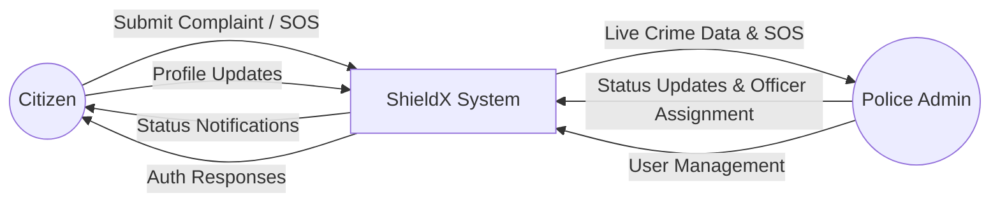
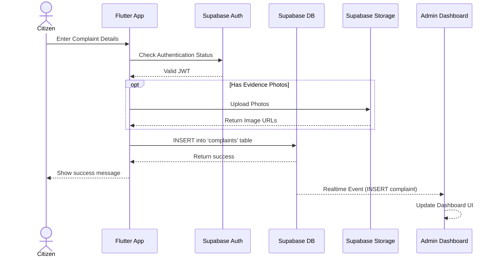
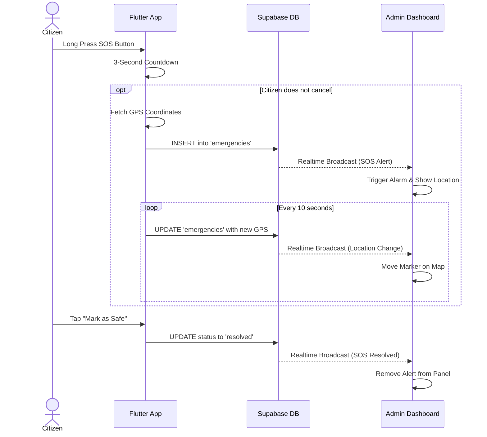
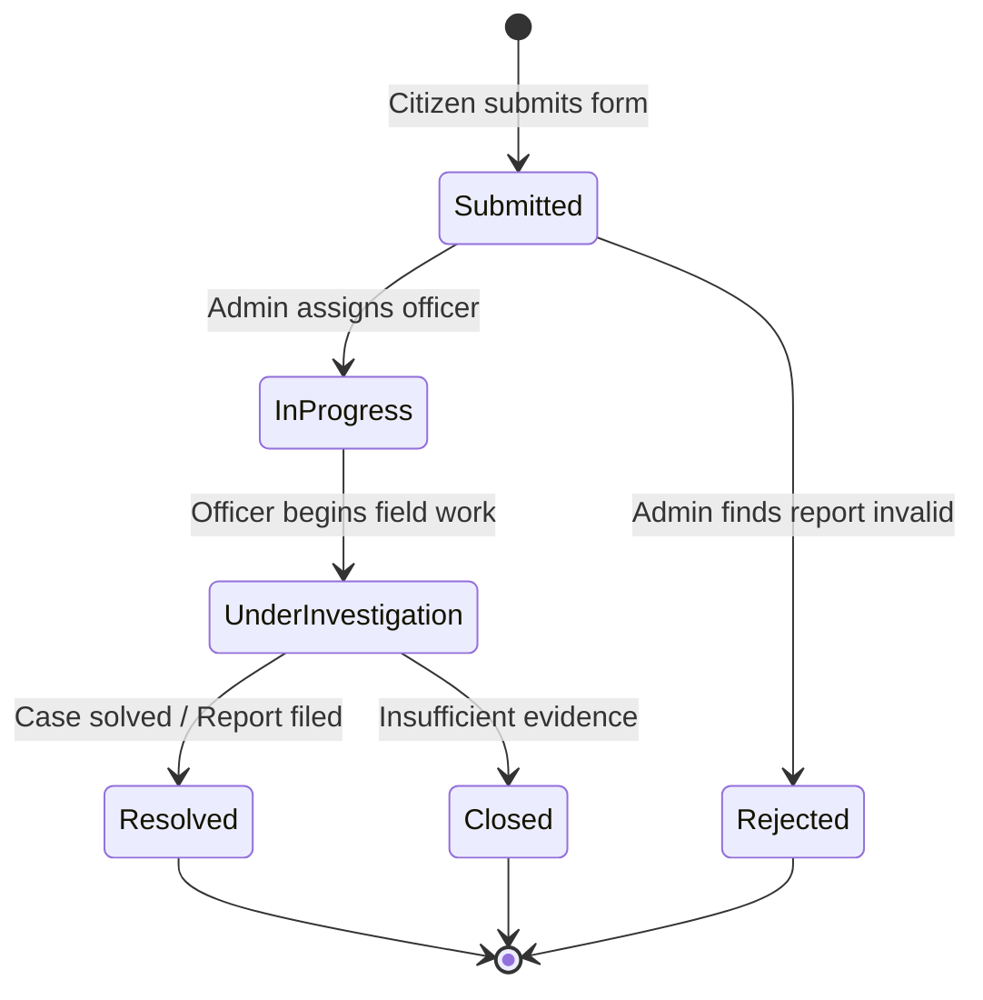

# ShieldX — Full Project Documentation
## Part 18: System Diagrams

---

## 18.1 Introduction

Visual representations of system processes are essential for academic defense to demonstrate the flow of data and control. This section contains architectural and behavioral diagrams using standard modeling techniques.

---

## 18.2 System Architecture Diagram

```mermaid
graph TD
    subgraph Client Application (Flutter)
        UI[User Interface]
        State[Riverpod State Management]
        Local[SharedPreferences / Offline Queue]
        
        UI <--> State
        State <--> Local
    end

    subgraph Backend Services (Supabase)
        Auth[Supabase Auth]
        DB[(PostgreSQL Database)]
        Storage[Supabase Storage]
        Realtime[Realtime Subscriptions]
    end

    State -- JWT Token --> Auth
    State -- REST API --> DB
    State -- WebSocket --> Realtime
    State -- Multipart Upload --> Storage
    
    DB -. Change Events .-> Realtime
```

---

## 18.3 Data Flow Diagram (DFD) - Level 0 (Context Diagram)



---

## 18.4 Sequence Diagram: Submit a Complaint



---

## 18.5 Sequence Diagram: SOS Emergency Alert



---

## 18.6 State Machine Diagram: Complaint Lifecycle



---

*Return to [Index — Table of Contents](INDEX.md)*
