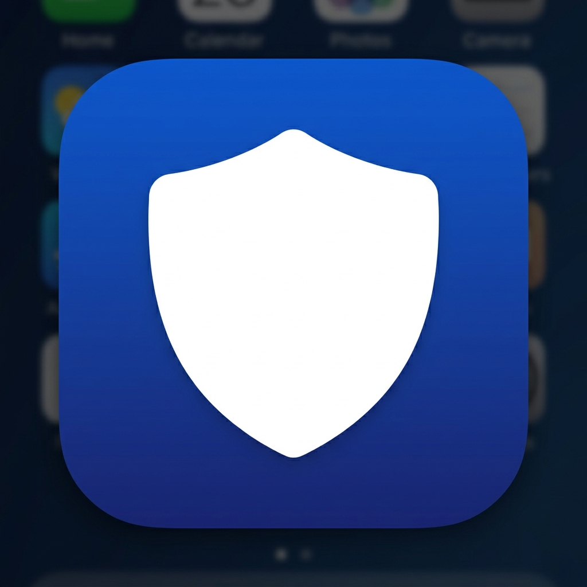

<div align="center">
  
  <h1>🛡️ ShieldX</h1>
  <p><strong>Crime Reporting & Emergency Management System</strong></p>
  
  <p>
    
    
    
  </p>
</div>

---

## 📖 Overview

**ShieldX** is a comprehensive mobile application designed to bridge the gap between citizens and law enforcement. Tailored for the **Sylhet Metropolitan Police (SMP)** jurisdiction, it empowers citizens to report crimes, track complaints in real-time, and trigger SOS alerts during emergencies. Simultaneously, it provides police administrators with a powerful dashboard to manage reports, dispatch officers, and monitor active emergencies.

---

## ✨ Key Features

### 👤 Citizen (User) Portal
- 🔐 **Secure Onboarding:** Multi-step registration with email/phone OTP verification and NID validation.
- 📝 **Smart Complaint Submission:** 3-step intuitive form with auto crime classification, live location picker, and multimedia evidence upload.
- 📡 **Real-time Tracking:** Live status updates tracking the journey of a complaint (`Submitted` ➡️ `In Progress` ➡️ `Investigating` ➡️ `Resolved`).
- 🚨 **SOS Emergency:** Instant one-tap panic button broadcasting live GPS coordinates, equipped with a 3-second cancellation window.
- 🗺️ **Interactive Police Map:** Integrated maps highlighting the nearest SMP stations based on the user's live geolocation.
- 🔔 **Instant Notifications:** Real-time push notifications keeping users informed of every status change.

### 👮 Admin & Officer Portal
- 📊 **Command Dashboard:** Live analytics featuring pie charts, trend graphs, and geographical location heatmaps.
- 📋 **Complaint Management:** Advanced filtering, sorting, officer assignment, and status updates for efficient case handling.
- 👥 **Access Control:** Manage citizen profiles, block/unblock malicious users, and assign admin privileges.
- 🚓 **Officer Dispatch:** Add and deploy field officers linked to specific regional stations.
- 🔴 **Live SOS Panel:** Real-time monitoring of active emergency alerts with precise citizen GPS coordinates.
- 🏢 **Station Switcher:** Dedicated views to analyze statistics for specific stations (e.g., Kotwali, Moglabazar).

---

## 🛠️ Technology Stack

| Layer | Technology |
|---|---|
| **UI Framework** | [Flutter](https://flutter.dev/) (Dart) |
| **State Management** | [Riverpod](https://riverpod.dev/) (`StateNotifier`, `StreamProvider`) |
| **Routing** | [GoRouter](https://pub.dev/packages/go_router) (Declarative, Redirect-based) |
| **Backend & Database**| [Supabase](https://supabase.com/) (PostgreSQL + Row Level Security) |
| **Real-time Sync** | Supabase Realtime (Postgres Change Events) |
| **Mapping Services** | `flutter_map` + OpenStreetMap Tiles |
| **Data Visualization** | `fl_chart` |
| **Animations** | `flutter_animate` |

---

## 🏗️ Architecture

The project follows a clean, modular architecture separating the Admin and User environments:

```text
lib/
├── admin/            # 👮 Admin-specific features and modules
│   ├── data/         # Models, repositories, and backend services
│   ├── presentation/ # Dashboards, complaint management, user control screens
│   └── providers/    # Admin-specific state management (Riverpod)
│
├── common/           # 📦 Shared modules and core infrastructure
│   ├── core/         # Theming, routing, constants, and utilities
│   ├── data/         # Shared data models and Authentication services
│   ├── presentation/ # Splash screens, notification panels, reusable widgets
│   └── providers/    # Global state management
│
└── user/             # 👤 Citizen-specific features and modules
    ├── data/         # User-focused data handling
    ├── presentation/ # Complaint submission, SOS, interactive maps, profiles
    └── providers/    # Citizen state management
```

---

## 🚀 Getting Started

Follow these steps to set up the project locally.

### Prerequisites
- **Flutter SDK** `>= 3.0`
- **Dart SDK** `>= 3.0`
- A **Supabase** project configured with the required schema and RPC functions.

### Installation

1. **Clone the repository:**
   ```bash
   git clone https://github.com/jogonnath1/Shieldx.git
   cd Shieldx
   ```

2. **Install dependencies:**
   ```bash
   flutter pub get
   ```

3. **Run the application:**
   ```bash
   flutter run
   ```

### Code Quality & Formatting
Ensure the codebase remains clean and consistent:
```bash
dart format --line-length 120 lib/   # Auto-format code
dart analyze lib/                     # Run static analysis
```

---

## 🗄️ Database Schema

The backend relies on a robust PostgreSQL database hosted on Supabase:

| Table | Purpose |
|---|---|
| `profiles` | Extended user data including name, phone, NID, role, and verification status. |
| `complaints` | Core table for crime reports containing status, geospatial data, and evidence URLs. |
| `status_history` | Audit trail logging every status change of a complaint for transparency. |
| `emergencies` | Live SOS alerts storing real-time GPS coordinates of users in distress. |
| `notifications` | Isolated notification inboxes for individual users. |
| `phone_verifications` | Temporary records handling OTP logic for phone verification. |

---

## 🔒 Security & Privacy

Security is a foundational element of ShieldX:
- **Row Level Security (RLS):** Strictly enforced on all Supabase tables ensuring citizens can only access their own data.
- **Authentication:** JWT-based access. The Supabase *anon key* is public by design and grants zero privileged access without a validated token.
- **Route Protection:** Admin pages are fortified at both the application level (GoRouter redirects) and database level (RLS policy `role` validation).

---
<div align="center">
  <sub>Built with ❤️ for a safer tomorrow.</sub>
</div>
