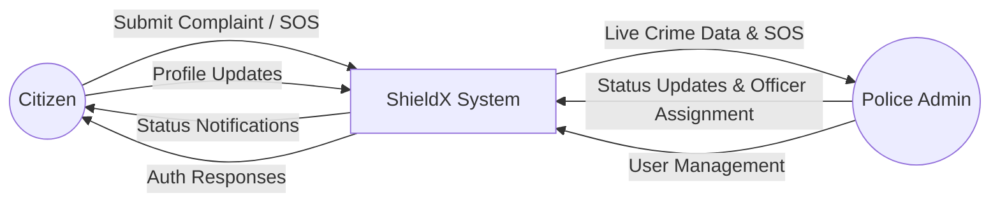
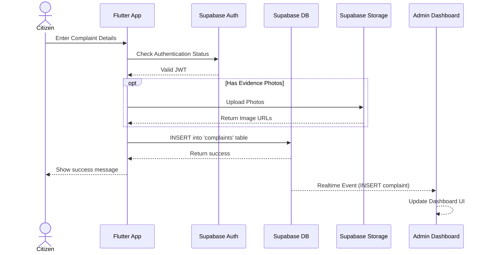
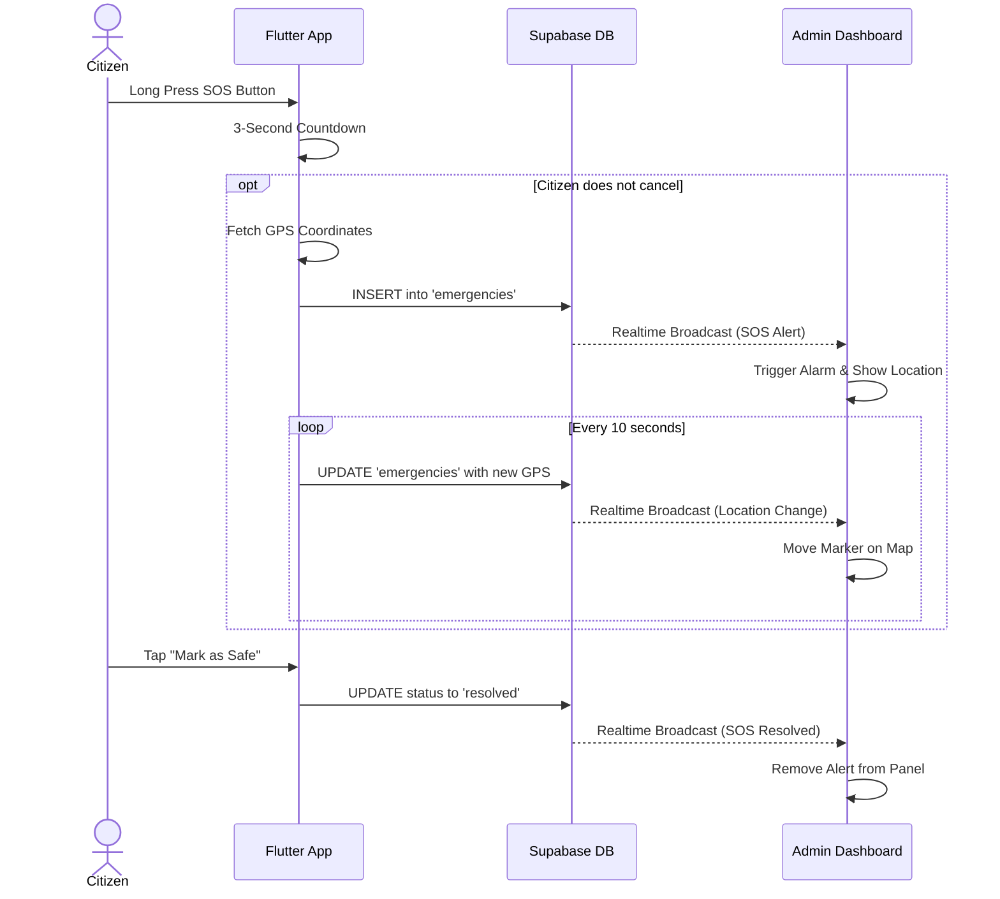
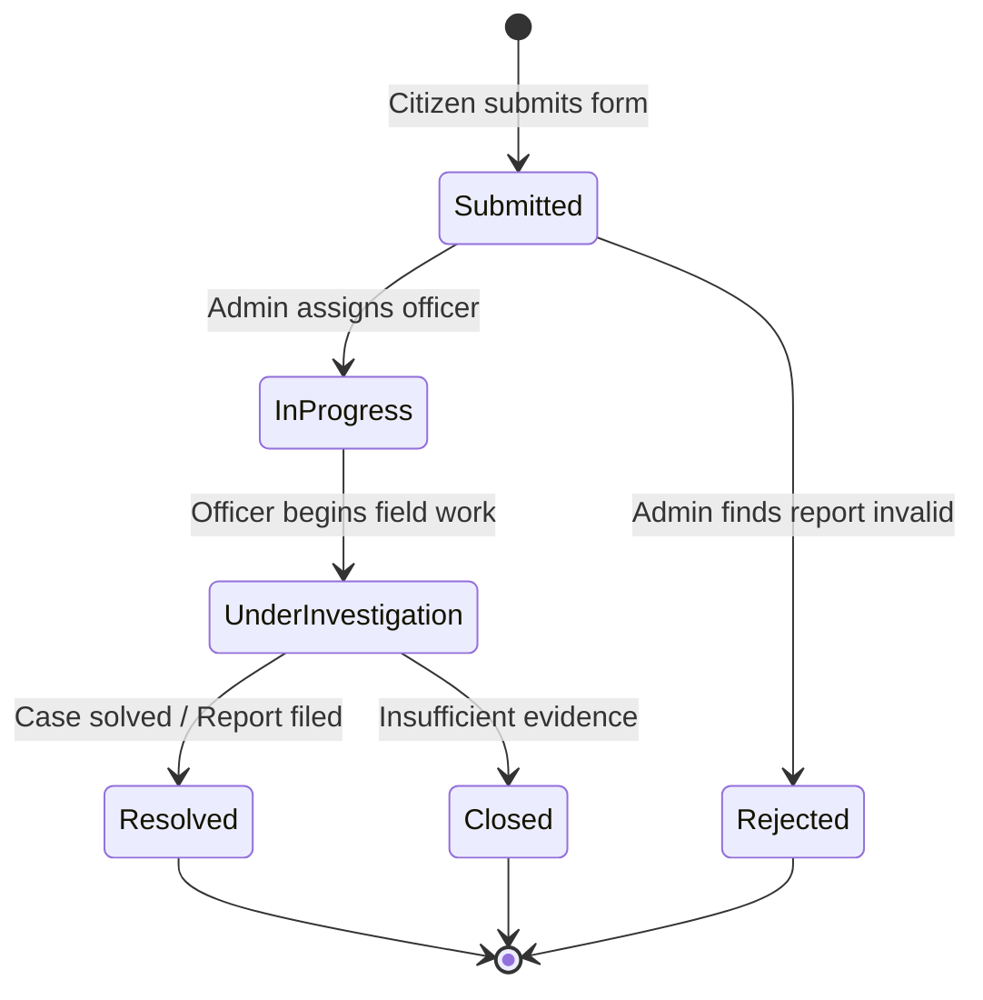

# ShieldX — Full Project Documentation
## Part 1: Project Overview

---

## 1.1 Introduction

**ShieldX** is a mobile application built for the **Sylhet Metropolitan Police (SMP)** that allows citizens to report crimes and enables police administrators to manage, track, and respond to those reports in real time.

The app has two distinct user roles:
- **Citizen (User)** — can register, submit crime reports, track complaint status, trigger SOS alerts, and find nearby police stations on a map.
- **Admin (Police Officer/Supervisor)** — can manage all complaints, users, officers, and stations from a dedicated admin dashboard.

---

## 1.2 Tech Stack

| Layer              | Technology                                          |
|--------------------|-----------------------------------------------------|
| UI Framework       | Flutter 3.x (Dart)                                  |
| State Management   | Riverpod (`StateNotifier`, `StreamProvider`)         |
| Navigation         | GoRouter (declarative, redirect-based)              |
| Backend / Auth     | Supabase (PostgreSQL + Row Level Security)          |
| Real-time          | Supabase Realtime (Postgres Change Events)          |
| Maps               | flutter_map + OpenStreetMap tiles                   |
| Charts             | fl_chart                                            |
| Local Storage      | SharedPreferences                                   |
| Animations         | flutter_animate                                     |
| Image Upload       | image_picker + Supabase Storage                    |
| Geolocation        | geolocator                                          |
| HTTP               | http (for OpenStreetMap / Overpass API)             |

---

## 1.3 Feature Summary

### Citizen (User) Side
| Feature                 | Description |
|-------------------------|-------------|
| Register & Login        | Multi-step registration with email + phone OTP verification and NID validation |
| Submit Complaint        | 3-step complaint form with auto crime classification, location picker, and evidence photo upload |
| Track Complaints        | Real-time status updates: `submitted → in progress → investigating → resolved` |
| SOS Emergency           | One-tap emergency alert with live GPS location tracking and 3-second cancellation window |
| Police Station Map      | Interactive map showing nearest Sylhet police stations based on GPS location |
| Notifications           | Real-time push notifications for every status change |
| Profile Management      | Edit profile, change email/password with OTP verification |
| Offline Support         | Complaints queued locally when offline and auto-synced on reconnect |

### Admin Side
| Feature                 | Description |
|-------------------------|-------------|
| Dashboard               | Live stats with pie chart, bar charts, monthly trends, and location heatmap |
| Complaint Management    | Filter, sort, bulk-delete, assign officers, update statuses |
| User Management         | Verify, block/unblock, promote to admin, delete citizens |
| Officer Management      | Add and manage field officers linked to specific stations |
| SOS Alert Panel         | Real-time panel showing active emergency alerts with citizen GPS coordinates |
| Station Switcher        | View statistics filtered per police station (Kotwali, Moglabazar, etc.) |

---

## 1.4 Supported Crime Categories

The system supports 14 crime categories with automatic keyword-based classification:

1. Theft
2. Robbery
3. Assault
4. Fraud
5. Cybercrime
6. Drug Offense
7. Murder
8. Kidnapping
9. Sexual Harassment
10. Domestic Violence
11. Vandalism
12. Corruption
13. Traffic Violation
14. Other

---

## 1.5 Complaint Status Lifecycle

```
submitted  →  in_progress  →  under_investigation  →  resolved
                                                    ↘  closed
                                                    ↘  rejected
```

Each status transition is recorded in the `status_history` table with a timestamp, admin note, and the ID of who made the change.

---

## 1.6 Jurisdiction

The app is designed for **Sylhet Metropolitan Police** with 6 supported thanas:

| Thana Name            | Key Areas |
|-----------------------|-----------|
| Kotwali Model Thana   | Zindabazar, Dargah, Bandar Bazar, Mirabazar |
| Moglabazar Thana      | Daudpur, Jalalpur, Kuchai, Silam |
| South Surma Thana     | Kadamtali, Boroikandi, Mominkhola |
| Shahporan Thana       | Tilagor, Baluchar, Khadimnagar, Uposhohor |
| Jalalabad Thana       | Akhalia, SUST, Kumargaon, Housing Estate |
| Airport Thana         | Lakkatura, Osmani International, Dhopagul |

---

## 1.7 Database Tables

| Table                | Purpose |
|----------------------|---------|
| `profiles`           | Extended user info: name, phone, NID, role, verification status, block status |
| `complaints`         | Crime reports with status, GPS coordinates, evidence URLs, officer assignment |
| `status_history`     | Audit log of every complaint status change |
| `emergencies`        | Active SOS alerts with live GPS coordinates |
| `notifications`      | Per-user notification inbox |
| `phone_verifications`| OTP records for demo phone verification |
| `officers`           | Field officer records linked to stations |
| `messages`           | Per-complaint chat messages between admin and citizen |

---

## 1.8 Security Design

- **Row Level Security (RLS)**: Enabled on all Supabase tables — citizens can only read/write their own data.
- **Router-level guards**: `redirect()` in GoRouter sends blocked users to `/blocked` and directs admins vs. users to their respective dashboards.
- **Database-level enforcement**: Supabase RLS policies check the `role` field in `profiles` for all sensitive operations.
- **Supabase anon key**: Intentionally public. It grants no privileged access without a valid JWT from successful authentication.

---

*Next: [Part 2 — Project Structure & Architecture](PART_2_Architecture.md)*
# ShieldX — Full Project Documentation
## Part 2: Project Structure & Architecture

---

## 2.1 High-Level Architecture

ShieldX follows a strict **4-layer architecture** with clear separation of concerns:

```
┌─────────────────────────────────────────────┐
│              Presentation Layer              │
│  (Screens + Widgets — no business logic)    │
└───────────────────┬─────────────────────────┘
                    │ watches / reads
┌───────────────────▼─────────────────────────┐
│               Provider Layer                 │
│  (Riverpod StateNotifiers — app state)      │
└───────────────────┬─────────────────────────┘
                    │ calls
┌───────────────────▼─────────────────────────┐
│                 Data Layer                   │
│  (Services — Supabase API calls only)       │
└───────────────────┬─────────────────────────┘
                    │ communicates with
┌───────────────────▼─────────────────────────┐
│              Supabase Backend                │
│  (PostgreSQL + RLS + Realtime + Storage)    │
└─────────────────────────────────────────────┘
```

**Key rule**: Screens only call providers. Providers call services. Services call Supabase. This keeps every layer testable in isolation.

---

## 2.2 Directory Map

```text
f:/Shieldx/
├── lib/
│   ├── main.dart                   ← App entry point (Supabase init, Riverpod scope)
│   ├── app.dart                    ← MaterialApp.router setup, theme injection
│   │
│   ├── admin/                      ← Admin module
│   │   ├── presentation/           ← Admin-only screens
│   │   │   ├── admin_complaints_screen.dart
│   │   │   ├── admin_complaint_detail_screen.dart
│   │   │   ├── admin_dashboard_screen.dart
│   │   │   ├── admin_officers_screen.dart
│   │   │   ├── admin_profile_screen.dart
│   │   │   ├── admin_shell.dart
│   │   │   ├── admin_sos_alert_widget.dart
│   │   │   ├── admin_stations_screen.dart
│   │   │   └── admin_users_screen.dart
│   │   └── providers/              ← Admin-specific state
│   │       └── admin_sos_provider.dart
│   │
│   ├── common/                     ← Shared core, data, UI, and state
│   │   ├── core/                   ← Cross-cutting concerns
│   │   │   ├── constants/          ← app_constants.dart, app_colors.dart
│   │   │   ├── router/             ← app_router.dart
│   │   │   ├── services/           ← preferences_service.dart
│   │   │   ├── theme/              ← app_theme.dart
│   │   │   └── utils/              ← validators, dialogs, classifiers
│   │   ├── data/                   ← Data access layer
│   │   │   ├── models/             ← Data classes
│   │   │   │   ├── complaint_model.dart
│   │   │   │   ├── emergency_model.dart
│   │   │   │   ├── message_model.dart
│   │   │   │   ├── notification_model.dart
│   │   │   │   ├── officer_model.dart
│   │   │   │   ├── police_station_model.dart
│   │   │   │   ├── profile_model.dart
│   │   │   │   └── status_history_model.dart
│   │   │   └── services/           ← All Supabase communication
│   │   │       ├── auth_service.dart
│   │   │       ├── complaint_service.dart
│   │   │       ├── emergency_service.dart
│   │   │       ├── map_service.dart
│   │   │       ├── message_service.dart
│   │   │       ├── notification_service.dart
│   │   │       ├── officer_service.dart
│   │   │       ├── profile_service.dart
│   │   │       ├── storage_service.dart
│   │   │       └── sync_service.dart
│   │   ├── presentation/           ← Shared UI
│   │   │   ├── auth/               ← splash, login, register, blocked
│   │   │   ├── common/             ← notifications_screen.dart
│   │   │   └── widgets/            ← admin, user, and common components
│   │   └── providers/              ← Global/Shared Riverpod state
│   │       ├── auth_provider.dart
│   │       ├── chat_provider.dart
│   │       ├── complaint_provider.dart
│   │       ├── connectivity_provider.dart
│   │       ├── gps_simulation_provider.dart
│   │       ├── location_cache_provider.dart
│   │       ├── navigation_trigger_provider.dart
│   │       ├── notification_provider.dart
│   │       ├── officer_provider.dart
│   │       ├── selected_station_provider.dart
│   │       ├── station_map_provider.dart
│   │       └── time_provider.dart
│   │
│   └── user/                       ← Citizen module
│       ├── presentation/           ← Citizen-only screens
│       │   ├── change_email_screen.dart
│       │   ├── change_password_screen.dart
│       │   ├── chat_screen.dart
│       │   ├── complaint_detail_screen.dart
│       │   ├── edit_complaint_screen.dart
│       │   ├── edit_profile_screen.dart
│       │   ├── home_screen.dart
│       │   ├── my_complaints_screen.dart
│       │   ├── police_stations_screen.dart
│       │   ├── profile_screen.dart
│       │   └── submit_complaint_screen.dart
│       └── providers/              ← Citizen-specific state
│           └── sos_provider.dart
│
├── assets/
│   ├── images/
│   ├── animations/
│   └── icons/
├── android/
├── ios/
├── web/
├── pubspec.yaml
├── README.md
└── ARCHITECTURE.md
```

---

## 2.3 Data Flow Example — Submit Complaint

This illustrates how data flows from a user action down to the database and back up:

```
1. User fills 3-step complaint form (SubmitComplaintScreen)
        │
        ▼
2. Widget calls: ref.read(complaintProvider.notifier).submitComplaint(data)
        │
        ▼
3. ComplaintNotifier calls: ComplaintService.submitComplaint(data)
        │
        ▼
4. ComplaintService does: supabase.from('complaints').insert(data).select()
        │
        ▼
5. Supabase inserts the row → fires Postgres Realtime change event
        │
        ▼
6. watchAllComplaints() stream emits updated complaint list
        │
        ▼
7. allComplaintsStreamProvider rebuilds with new data
        │
        ▼
8. AdminComplaintsScreen rebuilds automatically (no manual refresh)
```

---

## 2.4 Navigation Architecture (GoRouter)

All routes are defined in `app_router.dart` with a `redirect()` function that runs on every navigation event.

### Redirect Logic Flow

```
Every navigation event triggers redirect():
│
├── If authState.isLoading → stay on /splash (or stay on current auth route)
│
├── If user is logged in AND profile.isBlocked → force /blocked
│
├── If on /blocked AND user is not blocked → redirect to role-appropriate home
│
├── If not logged in → redirect to /login (unless already on auth route)
│
├── If profile is incomplete (missing phone/NID) → redirect to /register
│
└── If on an auth route while logged in → restore last route or go to role home
        ├── Admin → /admin/dashboard
        └── User  → /home
```

### Route Table

| Route                        | Screen                      | Auth Required | Role    |
|------------------------------|-----------------------------|---------------|---------|
| `/splash`                    | SplashScreen                | No            | Any     |
| `/login`                     | LoginScreen                 | No            | Any     |
| `/register`                  | RegisterScreen              | No            | Any     |
| `/forgot-password`           | ForgotPasswordScreen        | No            | Any     |
| `/blocked`                   | BlockedScreen               | Yes           | Any     |
| `/home`                      | HomeScreen                  | Yes           | User    |
| `/submit-complaint`          | SubmitComplaintScreen       | Yes           | User    |
| `/my-complaints`             | MyComplaintsScreen          | Yes           | User    |
| `/complaint/:id`             | ComplaintDetailScreen       | Yes           | User    |
| `/complaint/:id/edit`        | EditComplaintScreen         | Yes           | User    |
| `/police-stations`           | PoliceStationsScreen        | Yes           | User    |
| `/profile`                   | ProfileScreen               | Yes           | User    |
| `/edit-profile`              | EditProfileScreen           | Yes           | User    |
| `/change-password`           | ChangePasswordScreen        | Yes           | User    |
| `/change-email`              | ChangeEmailScreen           | Yes           | User    |
| `/notifications`             | NotificationsScreen         | Yes           | Any     |
| `/chat/:complaintId`         | ChatScreen                  | Yes           | User    |
| `/admin/dashboard`           | AdminDashboardScreen        | Yes           | Admin   |
| `/admin/complaints`          | AdminComplaintsScreen       | Yes           | Admin   |
| `/admin/complaints/:id`      | AdminComplaintDetailScreen  | Yes           | Admin   |
| `/admin/users`               | AdminUsersScreen            | Yes           | Admin   |
| `/admin/officers`            | AdminOfficersScreen         | Yes           | Admin   |
| `/admin/stations`            | AdminStationsScreen         | Yes           | Admin   |
| `/admin/profile`             | AdminProfileScreen          | Yes           | Admin   |

### Admin Shell Route

All `/admin/*` routes (except `/admin/complaints/:id`) are wrapped in a `ShellRoute` backed by `AdminShell`. This provides the persistent bottom navigation bar across all admin tabs without rebuilding it on every navigation.

---

## 2.5 Key Design Decisions

### 1. DRY — Shared `_buildStatusStats()` Helper
`getStats()`, `getStatsForStation()`, and `getAllStationsStats()` in `ComplaintService` share a single private `_buildStatusStats()` helper. Adding a new complaint status requires a one-line change in exactly one place.

### 2. GPS Fallback Chain
Both SOS and Station Map use a 4-step fallback:
```
1. GPS Simulation mode (if demo active)
2. Real device GPS (with 6–8 second timeout)
3. Last known position (fallback)
4. Default: Sylhet city centre (24.89996, 91.87030)
```

### 3. Real-time Profile Updates
When an admin blocks or verifies a citizen, `_setupProfileSubscription()` in `AuthNotifier` picks up the Supabase Realtime Postgres change event instantly — no polling required. The blocked citizen is immediately redirected to `/blocked`.

### 4. Offline Complaint Queue
`SyncService` stores pending complaints as JSON in `SharedPreferences` under the key `offline_complaint_outbox`. When `ConnectivityProvider` detects restored connectivity, the outbox is drained by calling `ComplaintService.submitComplaint()` for each item.

### 5. Route Persistence
`PreferencesService.saveLastRoute()` saves every non-auth route to `SharedPreferences`. On app restart, `AuthNotifier._init()` auto-logs in (if saved credentials exist), then `app_router.dart` restores the last route — so users land exactly where they left off.

---

*Next: [Part 3 — Core Module](PART_3_Core.md)*
# ShieldX — Full Project Documentation
## Part 3: Core Module

The `lib/common/core/` directory contains app-wide, framework-agnostic utilities that do not belong to any single feature. It is subdivided into five sub-packages.

---

## 3.1 `common/core/constants/app_constants.dart`

**Class**: `AppConstants` (private constructor — all members `static`)

Central registry of all magic strings used across the app. Changing a table name here propagates automatically to every service that imports this file.

| Constant / Method | Value / Behavior |
|-------------------|-----------------|
| `supabaseUrl` | `https://thucigugoxevxwrqpxjm.supabase.co` |
| `supabaseAnonKey` | Supabase anon JWT (public, safe) |
| `profilesTable` | `'profiles'` |
| `complaintsTable` | `'complaints'` |
| `officersTable` | `'officers'` |
| `statusHistoryTable` | `'status_history'` |
| `messagesTable` | `'messages'` |
| `notificationsTable` | `'notifications'` |
| `evidenceBucket` | `'evidence'` (Supabase Storage bucket for complaint photos) |
| `avatarBucket` | `'avatars'` (Supabase Storage bucket for profile photos) |
| `roleUser` | `'user'` |
| `roleAdmin` | `'admin'` |
| `complaintStatuses` | `['submitted', 'in_progress', 'under_investigation', 'resolved', 'closed', 'rejected']` |
| `crimeCategories` | List of 14 crime categories |
| `statusLabel(status)` | Returns a human-readable label for a status string |

---

## 3.2 `common/core/constants/app_colors.dart`

**Class**: `AppColors` (private constructor — all members `static const`)

Defines the entire visual design palette. The app uses a **dark theme** based on deep navy blues with a teal accent.

### Base Palette

| Name | Hex | Usage |
|------|-----|-------|
| `primary` | `#1565C0` | Primary buttons, active elements |
| `primaryLight` | `#1E88E5` | Lighter interactive states |
| `primaryDark` | `#0D47A1` | Pressed/dark states |
| `accent` | `#00BFA5` | Secondary CTAs, highlights |
| `accentLight` | `#1DE9B6` | Shimmer, glow effects |
| `background` | `#0A0E1A` | App background (deepest dark) |
| `surface` | `#111827` | Card/panel surface color |
| `surfaceLight` | `#1F2937` | Elevated surfaces |
| `card` | `#1C2333` | Card background |
| `cardBorder` | `#2D3748` | Card border/divider lines |
| `textPrimary` | `#F9FAFB` | Primary body text |
| `textSecondary` | `#9CA3AF` | Secondary / muted text |
| `textHint` | `#6B7280` | Placeholder / hint text |

### Status Colors

| Status | Color | Hex |
|--------|-------|-----|
| `submitted` | Blue | `#3B82F6` |
| `in_progress` | Amber | `#F59E0B` |
| `under_investigation` | Purple | `#8B5CF6` |
| `resolved` | Green | `#10B981` |
| `closed` | Gray | `#6B7280` |
| `rejected` | Red | `#EF4444` |

### Semantic Colors

| Name | Hex | Usage |
|------|-----|-------|
| `error` | `#EF4444` | Error states |
| `success` | `#10B981` | Success states |
| `warning` | `#F59E0B` | Warning states |
| `info` | `#3B82F6` | Info states |

### Gradients

| Name | Direction | Colors |
|------|-----------|--------|
| `primaryGradient` | top-left → bottom-right | `#1565C0` → `#0D47A1` |
| `backgroundGradient` | top → bottom | `#0A0E1A` → `#111827` |
| `cardGradient` | top-left → bottom-right | `#1C2333` → `#1A2540` |
| `accentGradient` | top-left → bottom-right | `#00BFA5` → `#1565C0` |

### Methods

```dart
static Color statusColor(String status)
// Returns the matching status color, or textSecondary for unknowns.
// Also handles 'offline_pending' → Colors.orangeAccent
```

---

## 3.3 `common/core/router/app_router.dart`

Defines the full GoRouter navigation tree and redirect logic.

### Providers

| Provider | Type | Purpose |
|----------|------|---------|
| `_routerNotifierProvider` | `Provider<_RouterNotifier>` | Bridges Riverpod auth state changes to GoRouter's `refreshListenable` |
| `routerProvider` | `Provider<GoRouter>` | The configured GoRouter instance |

### `_RouterNotifier`

An internal `ChangeNotifier` that listens to `authNotifierProvider` and calls `notifyListeners()` on every auth state change. This causes GoRouter to re-run the `redirect()` function.

```dart
class _RouterNotifier extends ChangeNotifier {
  _RouterNotifier(Ref ref) {
    ref.listen<AsyncValue<dynamic>>(authNotifierProvider, (_, __) {
      notifyListeners();
    });
  }
}
```

### Route persistence

After each navigation, the delegate listener saves the new route via `prefsService.saveLastRoute(location)` and fires `navigationTriggerProvider` to notify any watching widgets.

---

## 3.4 `common/core/services/preferences_service.dart`

**Class**: `PreferencesService`

Wraps `SharedPreferences` to provide typed access to all locally-persisted data.

| Provider | Purpose |
|----------|---------|
| `sharedPreferencesProvider` | Exposes the `SharedPreferences` instance (injected at startup via `ProviderScope.overrides`) |
| `preferencesServiceProvider` | Exposes the `PreferencesService` wrapper |

### Methods

| Method | Description |
|--------|-------------|
| `saveComplaintDraft(Map)` | Saves the in-progress complaint form as JSON |
| `getComplaintDraft()` | Retrieves the saved draft (or null) |
| `clearComplaintDraft()` | Removes the draft |
| `saveLastRoute(String)` | Persists the current route (skips auth routes) |
| `getLastRoute()` | Returns the last saved non-auth route |
| `clearLastRoute()` | Clears the saved route on sign-out |
| `saveCredentials(email, password)` | Stores login credentials for auto-login |
| `getSavedEmail()` | Returns saved email (or null) |
| `getSavedPassword()` | Returns saved password (or null) |
| `clearCredentials()` | Clears saved credentials (called on sign-out or block) |

> **Security Note**: Credentials are stored in plaintext for demo/development convenience. In production, replace with a secure keychain/keystore solution.

---

## 3.5 `common/core/utils/app_validators.dart`

**Class**: `AppValidators` (private constructor — all members `static`)

Centralized form validators used across all form screens.

| Validator | Signature | Rules |
|-----------|-----------|-------|
| `required(fieldName)` | `String? Function(String?)` | Rejects null or blank |
| `email` | `String? email(String?)` | Regex: `[\w\-\.]+@([\w\-]+\.)+[\w\-]{2,4}` |
| `phone` | `String? phone(String?)` | Bangladeshi: `01[3-9]\d{8}` (11 digits) |
| `password` | `String? password(String?)` | Minimum 8 characters |
| `confirmPassword(original)` | `String? Function(String?)` | Checks equality with `original` |
| `otp` | `String? otp(String?)` | Exactly 6 digits |
| `nid` | `String? nid(String?)` | Optional; 10 or 17 digits only |
| `minLength(length, {fieldName})` | `String? Function(String?)` | Generic min-length check |

---

## 3.6 `common/core/utils/complaint_classifier.dart`

**Class**: `ComplaintClassifier` (private constructor — all members `static`)

Auto-classifies a crime description text into one of the 14 supported categories by keyword matching.

### Algorithm

1. Normalize input to lowercase.
2. For each category, count how many of its keywords appear in the text.
3. Select the category with the highest keyword hit count.
4. Compute confidence = `hits / total_keywords_in_category`.
5. Map confidence to `ConfidenceLevel`:
   - ≥ 0.30 → **High**
   - ≥ 0.10 → **Medium**
   - < 0.10 → **Low**

### Return Type: `ClassificationResult?`

```dart
class ClassificationResult {
  final String category;        // e.g. 'Theft'
  final ConfidenceLevel confidence; // high | medium | low
  final int score;              // raw keyword hit count
  String get confidenceLabel;  // 'High confidence', etc.
}
```

Returns `null` if the description is shorter than 10 characters or no keywords match.

---

## 3.7 `common/core/utils/app_dialog.dart` and `app_snackbar.dart`

Reusable static helpers for consistent dialogs and snackbars throughout the app.

**`app_dialog.dart`** provides:
- `AppDialog.confirm(...)` — shows a confirmation dialog with cancel/confirm buttons
- `AppDialog.error(...)` — shows an error dialog
- `AppDialog.info(...)` — shows an info dialog

**`app_snackbar.dart`** provides:
- `AppSnackbar.success(...)` — shows a green success snackbar
- `AppSnackbar.error(...)` — shows a red error snackbar
- `AppSnackbar.info(...)` — shows a blue info snackbar

---

## 3.8 `common/core/theme/app_theme.dart`

Defines the `MaterialThemeData` for the app (dark mode):

- Uses `AppColors.background` for scaffold background
- Uses `AppColors.primary` for color scheme seed
- Applies `Google Fonts` for typography (via `google_fonts` package)
- Sets up `AppBar`, `Card`, `InputDecoration`, `ElevatedButton`, and `BottomNavigationBar` themes

---

## 3.9 `common/core/utils/date_time_extensions.dart`

**File**: `lib/common/core/utils/date_time_extensions.dart`

Provides extensions on `DateTime` for easy formatting (e.g. `TimeAgo` string representations, formatted date strings) used in UI components.

---

*Next: [Part 4 — Data Models](PART_4_Models.md)*
# ShieldX — Full Project Documentation
## Part 4: Data Models

All models live in `lib/common/data/models/`. They are **plain Dart classes** (no code generation). Each model follows the same pattern:
- `const` constructor with named parameters
- `factory ModelName.fromMap(Map<String, dynamic>)` — deserializes from Supabase response
- `Map<String, dynamic> toMap()` (or `toInsertMap()`) — serializes for Supabase insert/update
- `ModelName copyWith({...})` — immutable update helper

---

## 4.1 `ComplaintModel`

Represents a single crime report submitted by a citizen.

**File**: `lib/common/data/models/complaint_model.dart`

### Fields

| Field | Type | Nullable | Description |
|-------|------|----------|-------------|
| `id` | `String` | No | UUID primary key |
| `userId` | `String?` | Yes | FK → `profiles.id` (null for anonymous) |
| `firstName` | `String?` | Yes | Complainant first name |
| `lastName` | `String?` | Yes | Complainant last name |
| `phone` | `String?` | Yes | Complainant phone |
| `nid` | `String?` | Yes | Complainant NID |
| `profession` | `String?` | Yes | Complainant profession |
| `presentAddress` | `String?` | Yes | Complainant current address |
| `permanentAddress` | `String?` | Yes | Complainant permanent address |
| `crimeCategory` | `String?` | Yes | One of the 14 supported categories |
| `description` | `String?` | Yes | Free-text incident description |
| `latitude` | `double?` | Yes | Incident GPS latitude |
| `longitude` | `double?` | Yes | Incident GPS longitude |
| `locationAddress` | `String?` | Yes | Human-readable incident address (OSM reverse geocode) |
| `incidentDatetime` | `DateTime?` | Yes | When the incident occurred |
| `status` | `String` | No | Current status (default: `'submitted'`) |
| `assignedOfficerId` | `String?` | Yes | FK → `officers.id` |
| `evidenceUrls` | `List<String>` | No | Supabase Storage URLs for uploaded photos |
| `createdAt` | `DateTime?` | Yes | When the report was created |
| `updatedAt` | `DateTime?` | Yes | Last update timestamp |
| `deletedAt` | `DateTime?` | Yes | Soft-delete timestamp (null = active) |
| `isAnonymous` | `bool` | No | Whether personal info is hidden (default: `false`) |
| `policeStation` | `String?` | Yes | Target thana name |
| `assignedOfficerName` | `String?` | Yes | Joined officer name (read-only) |
| `userEmail` | `String?` | Yes | Joined user email (read-only) |
| `userName` | `String?` | Yes | Joined user name (read-only) |
| `userIsVerified` | `bool?` | Yes | Joined verification status (read-only) |

### Computed Properties

| Property | Returns |
|----------|---------|
| `fullName` | `'Anonymous User'` if anonymous, otherwise `firstName + lastName` |
| `caseId` | First 8 chars of UUID in uppercase (e.g. `A1B2C3D4`) |

### Serialization

`toInsertMap()` excludes computed/joined fields and `id` (auto-generated by Supabase).

---

## 4.2 `ProfileModel`

Represents a registered user's extended profile (stored in `profiles` table, which mirrors Supabase Auth).

**File**: `lib/common/data/models/profile_model.dart`

### Fields

| Field | Type | Nullable | Description |
|-------|------|----------|-------------|
| `id` | `String` | No | UUID — same as `auth.users.id` |
| `name` | `String?` | Yes | Full display name |
| `phone` | `String?` | Yes | Bangladeshi mobile number |
| `email` | `String?` | Yes | Email (pulled from `auth.users`, not stored in table) |
| `nid` | `String?` | Yes | National ID (10 or 17 digits) |
| `profession` | `String?` | Yes | User's occupation |
| `presentAddress` | `String?` | Yes | Current residential address |
| `permanentAddress` | `String?` | Yes | Permanent residential address |
| `avatarUrl` | `String?` | Yes | Supabase Storage URL for profile photo |
| `role` | `String` | No | `'user'` or `'admin'` (default: `'user'`) |
| `isVerified` | `bool` | No | Admin has verified this citizen (default: `false`) |
| `isBlocked` | `bool` | No | Admin has blocked this citizen (default: `false`) |
| `_isMainAdmin` | `bool` | No | Protected field for the main system admin |
| `fcmToken` | `String?` | Yes | Firebase Cloud Messaging token (reserved) |
| `createdAt` | `DateTime?` | Yes | Account creation timestamp |

### Computed Properties

| Property | Returns |
|----------|---------|
| `isAdmin` | `true` if `role == 'admin'` |
| `isMainAdmin` | `true` if `_isMainAdmin` OR email matches the hardcoded admin email |
| `displayName` | `name ?? email ?? 'User'` |
| `initials` | Up to 2 uppercase initials from `name`, or first char of `email` |

---

## 4.3 `EmergencyModel`

Represents an active SOS emergency alert.

**File**: `lib/common/data/models/emergency_model.dart`

### Fields

| Field | Type | Nullable | Description |
|-------|------|----------|-------------|
| `id` | `String` | No | UUID primary key |
| `userId` | `String` | No | FK → `profiles.id` |
| `latitude` | `double` | No | Current GPS latitude (updated live) |
| `longitude` | `double` | No | Current GPS longitude (updated live) |
| `status` | `String` | No | `'active'`, `'resolved'`, or `'cancelled'` |
| `createdAt` | `DateTime` | No | When SOS was triggered |
| `resolvedAt` | `DateTime?` | Yes | When resolved/cancelled |
| `resolvedBy` | `String?` | Yes | Admin ID who resolved it |
| `userProfile` | `ProfileModel?` | Yes | Joined citizen profile (for admin panel display) |

### Factory

`EmergencyModel.fromMap(map, {ProfileModel? userProfile})` — optionally accepts a pre-fetched profile to avoid extra queries.

---

## 4.4 `NotificationModel`

Represents a single in-app notification for a user.

**File**: `lib/common/data/models/notification_model.dart`

### Fields

| Field | Type | Nullable | Description |
|-------|------|----------|-------------|
| `id` | `String` | No | UUID primary key |
| `userId` | `String` | No | FK → `profiles.id` (recipient) |
| `title` | `String` | No | Notification heading |
| `message` | `String` | No | Notification body text |
| `type` | `String` | No | `'complaint'`, `'sos'`, or `'system'` |
| `relatedId` | `String?` | Yes | FK → complaint or emergency ID |
| `isRead` | `bool` | No | Whether the user has read it |
| `createdAt` | `DateTime` | No | Creation timestamp |
| `deletedAt` | `DateTime?` | Yes | Soft-delete timestamp |

### Computed Properties

| Property | Returns |
|----------|---------|
| `isSos` | `type == 'sos'` |
| `isComplaint` | `type == 'complaint'` |

---

## 4.5 `OfficerModel`

Represents a field officer assigned to a police station.

**File**: `lib/common/data/models/officer_model.dart`

### Fields

| Field | Type | Nullable | Description |
|-------|------|----------|-------------|
| `id` | `String` | No | UUID primary key |
| `name` | `String` | No | Officer full name |
| `badgeNumber` | `String?` | Yes | Police badge / service number |
| `rank` | `String?` | Yes | Officer rank (e.g. Inspector, SI) |
| `station` | `String?` | Yes | Police station name |
| `phone` | `String?` | Yes | Officer contact number |
| `isActive` | `bool` | No | Active/inactive status |
| `createdAt` | `DateTime?` | Yes | Record creation timestamp |

---

## 4.6 `StatusHistoryModel`

Represents a single audit entry in the complaint status timeline.

**File**: `lib/common/data/models/status_history_model.dart`

### Fields

| Field | Type | Nullable | Description |
|-------|------|----------|-------------|
| `id` | `String` | No | UUID primary key |
| `complaintId` | `String` | No | FK → `complaints.id` |
| `status` | `String` | No | The new status at this point |
| `note` | `String?` | Yes | Admin's note explaining the change |
| `changedBy` | `String?` | Yes | Admin user ID |
| `changedAt` | `DateTime` | No | Timestamp of the change |

---

## 4.7 `MessageModel`

Represents a single chat message in a complaint thread.

**File**: `lib/common/data/models/message_model.dart`

### Fields

| Field | Type | Nullable | Description |
|-------|------|----------|-------------|
| `id` | `String` | No | UUID primary key |
| `complaintId` | `String` | No | FK → `complaints.id` |
| `senderId` | `String` | No | FK → `profiles.id` |
| `content` | `String` | No | Message text body |
| `createdAt` | `DateTime` | No | Send timestamp |
| `isAdmin` | `bool` | No | Whether the sender is an admin |

---

## 4.8 `PoliceStationModel`

Represents a police station with full geographic and contact details.

**File**: `lib/common/data/models/police_station_model.dart`

This is a large static-data model containing data for all 6 SMP police stations. It includes:

- `id`, `name`, `thana` — identifiers
- `latitude`, `longitude` — GPS coordinates of the station building
- `address`, `phone`, `email` — contact details
- `officeHours` — opening hours
- `jurisdiction` — polygon of the thana boundary (list of lat/lng points)
- `landmarks` — notable nearby landmarks

---

## 4.9 `Police Stations Map Models`

Contains auxiliary models used for the interactive police station map and patrol routing.

**File**: `lib/user/presentation/models/police_stations_map_models.dart`

### Key Classes

*   `CityLandmark`: Represents a notable location in the city with a `name`, `location` (LatLng), and `PlaceType` (e.g., hospital, education, transport).
*   `HotspotCluster`: A clustering model used to aggregate nearby complaints into crime hotspots, calculating the geographic center and weight.
*   `PatrolRoute`: Represents an automated or suggested patrol route for officers, including the starting `station`, `hotspotCenter`, threat context, and a list of `routePoints` for map rendering.
*   `PlaceType`: An enum categorizing landmarks.

---

*Next: [Part 5 — Data Services](PART_5_Services.md)*
# ShieldX — Full Project Documentation
## Part 5: Data Services

All Supabase communication is isolated in `lib/common/data/services/`. No widget or provider ever imports `supabase_flutter` directly — they always go through a service class. This keeps the data layer easily mockable and testable.

---

## 5.1 `AuthService`

**File**: `lib/common/data/services/auth_service.dart`

Handles all Supabase Auth operations and profile CRUD.

| Property | Type | Description |
|----------|------|-------------|
| `currentUser` | `User?` | Currently authenticated Supabase user (or null) |
| `isLoggedIn` | `bool` | Whether a session exists |
| `authStateChanges` | `Stream<AuthState>` | Supabase auth event stream |

### Methods

| Method | Returns | Description |
|--------|---------|-------------|
| `checkContactExists({email, phone})` | `Future<Map<String, bool>>` | Calls `check_contact_exists` RPC — checks if email/phone are already registered |
| `checkNidExists(nid)` | `Future<bool>` | Calls `check_nid_exists` RPC — ensures NID uniqueness |
| `signUp({email, password, name, phone, nid, ...})` | `Future<AuthResponse>` | Creates Supabase Auth user + upserts profile row |
| `sendPhoneOtp(phone)` | `Future<void>` | Sends OTP via Supabase phone auth |
| `verifyPhoneOtp(phone, token)` | `Future<AuthResponse>` | Verifies the phone OTP |
| `sendEmailOtp(email)` | `Future<void>` | Sends OTP via Supabase email auth |
| `verifyEmailOtp(email, token)` | `Future<AuthResponse>` | Verifies the email OTP |
| `sendPasswordResetOtp(email)` | `Future<void>` | Sends password reset email |
| `verifyPasswordResetOtp(email, token)` | `Future<AuthResponse>` | Verifies the recovery OTP |
| `saveMockOtp(phone, otp)` | `Future<void>` | Saves a demo OTP to `phone_verifications` table |
| `verifyMockOtp(phone, otp)` | `Future<bool>` | Verifies a demo OTP from `phone_verifications` |
| `deleteIncompleteRegistration()` | `Future<bool>` | Calls `delete_incomplete_registration` RPC — cleans up half-finished registrations |
| `isEmailBlocked(email)` | `Future<bool>` | Calls `is_user_blocked` RPC |
| `signIn({email, password})` | `Future<AuthResponse>` | Signs in with email/password |
| `signOut()` | `Future<void>` | Signs out the current session |
| `resetPassword(email)` | `Future<void>` | Sends password reset email with deep-link redirect |
| `updatePassword(newPassword)` | `Future<UserResponse>` | Updates auth password |
| `updateEmail(newEmail)` | `Future<UserResponse>` | Initiates email change (requires OTP) |
| `verifyEmailChangeOtp(email, token)` | `Future<AuthResponse>` | Confirms the email change OTP |
| `getCurrentProfile()` | `Future<ProfileModel?>` | Fetches profile from DB; merges `email` from auth |
| `updateProfile(userId, data)` | `Future<void>` | Updates profile fields |
| `subscribeToProfile(userId, onUpdate)` | `RealtimeChannel` | Opens a Supabase Realtime subscription on the user's profile row |
| `removeChannel(channel)` | `Future<void>` | Closes a Realtime channel |

### Real-time Profile Subscription

```dart
_client
  .channel('public:profiles:id=eq.$userId')
  .onPostgresChanges(
    event: PostgresChangeEvent.update,
    table: 'profiles',
    filter: PostgresChangeFilter(type: eq, column: 'id', value: userId),
    callback: (payload) => onUpdate(ProfileModel.fromMap(payload.newRecord)),
  )
  .subscribe();
```

---

## 5.2 `ComplaintService`

**File**: `lib/common/data/services/complaint_service.dart`

Handles all CRUD, streaming, statistics, and soft-delete operations for the `complaints` table.

### Write Operations

| Method | Description |
|--------|-------------|
| `submitComplaint(data)` | Inserts a new complaint row; returns the created `ComplaintModel` |
| `updateComplaint(id, data)` | Updates an editable complaint (only if status == `'submitted'`) |
| `updateComplaintStatus({complaintId, status, note, assignedOfficerId, changedBy})` | Updates status + inserts `status_history` row |
| `deleteComplaint(id)` | Soft-deletes by setting `deleted_at` |
| `deleteComplaints(ids)` | Bulk soft-deletes |
| `restoreComplaint(id)` | Restores a soft-deleted complaint |
| `restoreComplaints(ids)` | Bulk restore |
| `hardDeleteComplaints(ids)` | Permanently deletes (admin only) |
| `hardDeleteAllUserComplaints(userId)` | Permanently deletes all soft-deleted complaints for a user |
| `hardDeleteAllComplaints()` | Permanently deletes all soft-deleted complaints (admin cleanup) |

### Read Operations

| Method | Returns | Description |
|--------|---------|-------------|
| `getUserComplaints(userId)` | `Future<List<ComplaintModel>>` | All active complaints for a user |
| `getAllComplaints({status, limit, offset})` | `Future<List<ComplaintModel>>` | Paginated list with optional status filter |
| `getComplaint(id)` | `Future<ComplaintModel?>` | Single complaint by ID |
| `getStatusHistory(complaintId)` | `Future<List<StatusHistoryModel>>` | Full audit trail for a complaint |
| `getDeletedUserComplaints(userId)` | `Future<List<ComplaintModel>>` | Soft-deleted complaints for a user |
| `getDeletedAllComplaints()` | `Future<List<ComplaintModel>>` | All soft-deleted complaints |
| `getHistoricalCrimeCoordinates()` | `Future<List<ComplaintModel>>` | All complaints with GPS coords (for heatmap) |

### Real-time Streams

| Method | Returns | Description |
|--------|---------|-------------|
| `watchUserComplaints(userId)` | `Stream<List<ComplaintModel>>` | Live stream of a citizen's complaints |
| `watchAllComplaints({stationThana})` | `Stream<List<ComplaintModel>>` | Live stream of all complaints; optionally filtered by thana |

### Statistics

| Method | Returns | Description |
|--------|---------|-------------|
| `getStats()` | `Future<Map<String, int>>` | Overall counts grouped by status |
| `getCategoryStats()` | `Future<Map<String, int>>` | Top 7 crime categories by complaint count |
| `getStatsForStation({stationThana})` | `Future<Map<String, int>>` | Status counts for a specific thana |
| `getCategoryStatsForStation({stationThana})` | `Future<Map<String, int>>` | Category stats for a specific thana |
| `getAllStationsStats(thanas)` | `Future<Map<String, Map<String, int>>>` | Stats for all thanas in one query |

### Private Helpers

| Method | Description |
|--------|-------------|
| `_buildStatusStats(items)` | Counts items by status — shared by all three stats methods |
| `_filterByThana(list, stationThana)` | Filters complaint rows by thana keyword matching |
| `_thanaKeywords(thana)` | Maps thana name → list of known locality keywords |

---

## 5.3 `EmergencyService`

**File**: `lib/common/data/services/emergency_service.dart`

Handles SOS alert lifecycle and admin notifications.

| Method | Returns | Description |
|--------|---------|-------------|
| `triggerSOS(lat, lng)` | `Future<EmergencyModel>` | Cancels any existing active SOS, creates a new one, notifies all admins |
| `updateEmergencyLocation(emergencyId, lat, lng)` | `Future<void>` | Updates GPS coordinates for a live SOS |
| `cancelEmergency(emergencyId)` | `Future<void>` | Marks SOS as cancelled, removes the 🚨 notification, sends a ✅ safe notification |
| `resolveEmergency(emergencyId, adminId)` | `Future<void>` | Admin marks the emergency as resolved |
| `watchActiveEmergencies()` | `Stream<List<EmergencyModel>>` | Real-time stream of all active SOS alerts with de-duplicated user profiles |
| `watchEmergency(emergencyId)` | `Stream<EmergencyModel?>` | Real-time stream of a single emergency with its citizen profile |

### Admin Notification Logic

`_notifyAdmins()` is a private helper that:
1. Fetches all profiles where `role == 'admin'`
2. Creates a `notifications` row for each admin with the given `title`, `message`, and `type`
3. Inserts all in a single batch for efficiency

---

## 5.4 `NotificationService`

**File**: `lib/common/data/services/notification_service.dart`

| Method | Returns | Description |
|--------|---------|-------------|
| `watchNotifications(userId)` | `Stream<List<NotificationModel>>` | Real-time stream of undeleted notifications for a user |
| `markRead(notificationId)` | `Future<void>` | Sets `is_read = true` |
| `markAllRead(userId)` | `Future<void>` | Marks all unread notifications read for a user |
| `deleteNotification(notificationId)` | `Future<void>` | Soft-deletes a notification |
| `getDeletedNotifications(userId)` | `Future<List<NotificationModel>>` | Fetches soft-deleted notifications (trash) |
| `restoreNotification(id)` | `Future<void>` | Restores from trash |
| `hardDeleteNotification(id)` | `Future<void>` | Permanently deletes |

---

## 5.5 `ProfileService`

**File**: `lib/common/data/services/profile_service.dart`

Admin-only user management operations.

| Method | Returns | Description |
|--------|---------|-------------|
| `getAllUsers()` | `Future<List<ProfileModel>>` | Fetches all user-role profiles |
| `verifyUser(userId)` | `Future<void>` | Sets `is_verified = true` |
| `unverifyUser(userId)` | `Future<void>` | Sets `is_verified = false` |
| `blockUser(userId)` | `Future<void>` | Sets `is_blocked = true` |
| `unblockUser(userId)` | `Future<void>` | Sets `is_blocked = false` |
| `promoteToAdmin(userId)` | `Future<void>` | Sets `role = 'admin'` |
| `deleteUser(userId)` | `Future<void>` | Calls `delete_user_account` RPC (removes auth + profile) |

---

## 5.6 `StorageService`

**File**: `lib/common/data/services/storage_service.dart`

Manages file uploads to Supabase Storage.

| Method | Returns | Description |
|--------|---------|-------------|
| `uploadEvidence(file, userId)` | `Future<String>` | Uploads a complaint evidence photo to the `evidence` bucket; returns the public URL |
| `uploadAvatar(file, userId)` | `Future<String>` | Uploads a profile photo to the `avatars` bucket; returns the public URL |
| `deleteFile(bucket, path)` | `Future<void>` | Deletes a file from the given bucket |

---

## 5.7 `MapService`

**File**: `lib/common/data/services/map_service.dart`

Handles external HTTP calls to the OpenStreetMap Nominatim API.

| Method | Returns | Description |
|--------|---------|-------------|
| `reverseGeocode(lat, lng)` | `Future<String?>` | Converts GPS coordinates to a human-readable address via Nominatim |
| `geocode(query)` | `Future<Map?>` | Converts an address query to coordinates via Nominatim |

---

## 5.8 `OfficerService`

**File**: `lib/common/data/services/officer_service.dart`

| Method | Returns | Description |
|--------|---------|-------------|
| `getOfficers({station})` | `Future<List<OfficerModel>>` | Fetches officers, optionally filtered by station |
| `addOfficer(data)` | `Future<void>` | Inserts a new officer record |
| `deleteOfficer(id)` | `Future<void>` | Deletes an officer record |

---

## 5.9 `MessageService`

**File**: `lib/common/data/services/message_service.dart`

Per-complaint chat between citizen and admin.

| Method | Returns | Description |
|--------|---------|-------------|
| `watchMessages(complaintId)` | `Stream<List<MessageModel>>` | Real-time chat stream for a complaint |
| `sendMessage({complaintId, content, isAdmin})` | `Future<void>` | Inserts a new message |

---

## 5.10 `SyncService`

**File**: `lib/common/data/services/sync_service.dart`

Singleton service for offline complaint queuing and cache management.

### Architecture

`SyncService` is a **singleton** (`SyncService._instance`). All reads/writes go through `SharedPreferences`.

### Storage Keys

| Key | Content |
|-----|---------|
| `offline_complaint_outbox` | `List<String>` — JSON-encoded pending complaint maps |
| `cached_user_complaints_<userId>` | `List<String>` — JSON-encoded cached complaint models |
| `cached_admin_complaints` | `List<String>` — JSON-encoded cached complaint models (admin) |

### Methods

| Method | Returns | Description |
|--------|---------|-------------|
| `cacheUserComplaints(userId, complaints)` | `Future<void>` | Saves the citizen's complaint list to local storage |
| `getCachedUserComplaints(userId)` | `Future<List<ComplaintModel>>` | Loads cached complaints (used when offline) |
| `cacheAdminComplaints(complaints)` | `Future<void>` | Saves the admin complaint list to local storage |
| `getCachedAdminComplaints()` | `Future<List<ComplaintModel>>` | Loads cached admin complaints |
| `addToOutbox(data)` | `Future<void>` | Adds an offline-pending complaint to the outbox and immediately adds it to the user cache with status `'offline_pending'` |
| `getOutboxCount()` | `Future<int>` | Returns how many complaints are awaiting sync |
| `syncOfflineOutbox()` | `Future<void>` | Tries to submit each outbox item to Supabase; keeps failures in the outbox |
| `filterComplaintsByThana(list, thana)` | `List<ComplaintModel>` | Locally filters a cached complaint list by thana keywords |

### Sync Flow

```
ConnectivityProvider detects internet restored
        │
        ▼
SyncService.syncOfflineOutbox() is called
        │
        ├── For each item in outbox:
        │       └── ComplaintService.submitComplaint(data)
        │               ├── SUCCESS → remove from outbox
        │               └── FAILURE → keep in outbox for next retry
        │
        └── Log result counts with debugPrint
```

---

*Next: [Part 6 — Providers (State Management)](PART_6_Providers.md)*
# ShieldX — Full Project Documentation
## Part 6: Providers (State Management)

Most Riverpod providers live in `lib/common/providers/`. Feature-specific providers are placed in `lib/admin/providers/` or `lib/user/providers/`. Every provider has a single responsibility and communicates only downward (never laterally between providers except via `ref.read/watch`).

---

## 6.1 `auth_provider.dart`

The most critical provider file. Manages authentication state for the entire app.

### Providers

| Provider | Type | Purpose |
|----------|------|---------|
| `authServiceProvider` | `Provider<AuthService>` | Singleton `AuthService` instance |
| `authStateProvider` | `StreamProvider<AuthState>` | Raw Supabase auth event stream |
| `currentUserProvider` | `Provider<User?>` | Currently authenticated Supabase `User` (or null) |
| `currentProfileProvider` | `FutureProvider<ProfileModel?>` | One-time fetch of the current user's profile |
| `authNotifierProvider` | `StateNotifierProvider<AuthNotifier, AsyncValue<ProfileModel?>>` | **Primary auth state** — reactive profile with real-time updates |

### `AuthNotifier` (StateNotifier)

State: `AsyncValue<ProfileModel?>`
- `AsyncValue.loading()` — auth check in progress
- `AsyncValue.data(profile)` — authenticated (profile can be null if signed out)
- `AsyncValue.error(e, st)` — unexpected error

#### Startup Sequence (`_init()`)

```
1. Try Supabase.currentUser → fetch profile
2. If no session → check SharedPreferences for saved email/password
3. If credentials found → check if user is blocked → auto sign-in
4. If profile is blocked → sign out + clear credentials
5. If authenticated → subscribe to real-time profile updates
6. Set state to AsyncValue.data(profile)
```

#### Key Methods

| Method | Description |
|--------|-------------|
| `signIn(email, password)` | Checks block status → signs in → fetches profile → sets up realtime |
| `signUp({...})` | Creates account → fetches profile → sets state |
| `signOut()` | Cancels realtime → signs out → clears stored route and credentials |
| `refresh()` | Re-fetches profile from DB; signs out if blocked |
| `updateProfileDetails({...})` | Updates profile + refreshes state |
| `checkContactExists({email, phone})` | Delegates to AuthService |
| `checkNidExists(nid)` | Delegates to AuthService |
| `sendPhoneOtp(phone)` / `verifyPhoneOtp(phone, token)` | OTP flow delegates |
| `sendEmailOtp(email)` / `verifyEmailOtp(email, token)` | OTP flow delegates |
| `saveMockOtp(phone, otp)` / `verifyMockOtp(phone, otp)` | Demo phone OTP delegates |
| `deleteIncompleteRegistration()` | Cleans up half-finished registration |
| `_setupProfileSubscription(profile)` | Opens Supabase Realtime channel for the user's profile row |
| `_cancelProfileSubscription()` | Closes the realtime channel |

---

## 6.2 `complaint_provider.dart`

Manages citizen complaint state with offline support.

### Providers

| Provider | Type | Purpose |
|----------|------|---------|
| `complaintServiceProvider` | `Provider<ComplaintService>` | Singleton `ComplaintService` |
| `syncServiceProvider` | `Provider<SyncService>` | Singleton `SyncService` |
| `complaintProvider` | `StateNotifierProvider<ComplaintNotifier, AsyncValue<List<ComplaintModel>>>` | Citizen's complaint list (with offline cache) |
| `allComplaintsStreamProvider` | `StreamProvider<List<ComplaintModel>>` | Real-time stream of ALL complaints (admin) |
| `filteredComplaintsStreamProvider` | `StreamProvider.family<List<ComplaintModel>, String?>` | All complaints filtered by thana (admin station view) |

### `ComplaintNotifier`

State: `AsyncValue<List<ComplaintModel>>`

| Method | Description |
|--------|-------------|
| `loadUserComplaints(userId)` | Loads from Supabase; falls back to cache if offline; caches on success |
| `submitComplaint(data)` | Submits online; falls back to `SyncService.addToOutbox()` if offline |
| `updateComplaintStatus({...})` | Delegates to `ComplaintService.updateComplaintStatus()` |
| `deleteComplaint(id)` | Soft-deletes and removes from local state |
| `watchUserComplaints(userId)` | Subscribes to the real-time stream and updates state on each emission |

---

## 6.3 `sos_provider.dart`

Manages the full SOS alert lifecycle.

### State: `SOSState`

```dart
class SOSState {
  final SOSStatus status;         // idle | countingDown | active | error
  final int countdown;            // 3, 2, 1 (during countingDown)
  final String? activeEmergencyId;
  final String? errorMessage;
  final double? currentLatitude;  // updated live during active SOS
  final double? currentLongitude;
}
```

### `SOSStatus` enum

| Value | Meaning |
|-------|---------|
| `idle` | No SOS active |
| `countingDown` | 3-second countdown before alert is sent |
| `active` | Alert sent; live GPS tracking running |
| `error` | Something went wrong (message in `errorMessage`) |

### Key Methods on `SOSNotifier`

| Method | Description |
|--------|-------------|
| `startSOS()` | Checks permissions → checks if user is verified → starts 3-second countdown timer |
| `cancelSOSCountdown()` | Cancels during countdown window; resets to idle |
| `markSafe()` | Calls `EmergencyService.cancelEmergency()`; stops GPS tracking; resets to idle |
| `resetToIdle()` | Force-resets state |

### Internal Flow

```
startSOS()
  → validate (verified user + GPS permission)
  → state = countingDown (3 → 2 → 1)
  → _triggerSOSAlert()
      → get GPS (simulation or real device or last known or default)
      → EmergencyService.triggerSOS(lat, lng)
      → state = active
      → _startLiveLocationTracking(emergencyId)
      → _listenToEmergencyStatus(emergencyId)
            → if status == 'resolved' → reset to idle
```

### Additional Provider

| Provider | Type | Description |
|----------|------|-------------|
| `currentEmergencyStreamProvider` | `StreamProvider.family<EmergencyModel?, String>` | Watches a specific emergency by ID |

---

## 6.4 `station_map_provider.dart`

Manages the interactive police stations map state.

### State: `StationMapState`

```dart
class StationMapState {
  final List<PoliceStationModel> stations;
  final PoliceStationModel? selectedStation;
  final double? userLatitude;
  final double? userLongitude;
  final bool isLoadingLocation;
  final String? locationError;
}
```

### Key Operations

| Method | Description |
|--------|-------------|
| `loadUserLocation()` | GPS fallback chain → updates `userLatitude/userLongitude` |
| `selectStation(station)` | Sets `selectedStation` |
| `findNearestStation()` | Calculates Haversine distance to each station; selects closest |

---

## 6.5 `notification_provider.dart`

Manages the real-time notification inbox.

| Provider | Type | Purpose |
|----------|------|---------|
| `notificationServiceProvider` | `Provider<NotificationService>` | Singleton |
| `notificationProvider` | `StateNotifierProvider<NotificationNotifier, AsyncValue<List<NotificationModel>>>` | Reactive notification list |

### `NotificationNotifier`

| Method | Description |
|--------|-------------|
| `watchNotifications(userId)` | Subscribes to real-time stream |
| `markRead(id)` | Marks notification read + updates local state |
| `markAllRead(userId)` | Marks all read |
| `deleteNotification(id)` | Soft-deletes + removes from local list |

---

## 6.6 `connectivity_provider.dart`

| Provider | Type | Purpose |
|----------|------|---------|
| `connectivityProvider` | `StateNotifierProvider<ConnectivityNotifier, bool>` | `true` = online, `false` = offline |

### `ConnectivityNotifier`

Periodically checks internet connectivity by attempting to reach `8.8.8.8:53` (Google DNS). When transitioning from offline → online, it triggers `SyncService.syncOfflineOutbox()`.

---

## 6.7 `gps_simulation_provider.dart`

Developer/demo tool for testing GPS-dependent features without a real device outdoors.

### State: `GpsSimulationState`

```dart
class GpsSimulationState {
  final bool isSimulationActive;
  final double latitude;
  final double longitude;
}
```

When `isSimulationActive = true`, all GPS-consuming providers (`SOSNotifier`, `StationMapProvider`) use the simulated coordinates instead of the real device GPS.

---

## 6.8 Other Providers

| File | Provider | Type | Purpose |
|------|----------|------|---------|
| `admin_sos_provider.dart` | `adminSosProvider` | `StreamProvider` | Real-time stream of active SOS alerts for the admin panel |
| `officer_provider.dart` | `officerProvider` | `FutureProvider.family` | Loads officers for a given station |
| `selected_station_provider.dart` | `selectedStationProvider` | `StateProvider<String?>` | Currently selected thana in the admin station switcher |
| `navigation_trigger_provider.dart` | `navigationTriggerProvider` | `StateNotifierProvider` | Fires an event on every route change (used to refresh data on tab switch) |
| `time_provider.dart` | `timeProvider` | `StreamProvider<DateTime>` | Emits the current time every minute (for live clocks/age displays) |
| `location_cache_provider.dart` | `locationCacheProvider` | `StateNotifierProvider` | Caches reverse-geocoded addresses to avoid repeated API calls |
| `chat_provider.dart` | `chatProvider` | `StreamProvider.family` | Real-time message stream for a specific complaint |

---

*Next: [Part 7 — Presentation: Auth Screens](PART_7_Auth_Screens.md)*
# ShieldX — Full Project Documentation
## Part 7: Presentation — Authentication Screens

Authentication screens live in `lib/common/presentation/auth/`. They handle the complete user onboarding flow from app launch to dashboard.

---

## 7.1 `SplashScreen`

**File**: `lib/common/presentation/auth/splash_screen.dart`  
**Route**: `/splash`

The first screen the app shows. It displays the ShieldX logo with an animated entrance while `AuthNotifier._init()` runs in the background. GoRouter's `redirect()` will automatically navigate away once the auth state is resolved.

**Behavior**:
- Shows logo + tagline animation
- No user interaction — purely passive
- Automatically redirected by the router once `authState.isLoading` becomes `false`

---

## 7.2 `LoginScreen`

**File**: `lib/common/presentation/auth/login_screen.dart`  
**Route**: `/login`

Email and password login form.

**UI Elements**:
- Email text field (keyboard type: `emailAddress`)
- Password text field (with show/hide toggle)
- "Remember Me" checkbox → saves credentials to `PreferencesService`
- "Forgot password?" link → navigates to `/forgot-password`
- Sign In button
- "Create Account" link → navigates to `/register`

**Validation**:
- Uses `AppValidators.email` and `AppValidators.password`

**Auth Flow**:
```
User taps Sign In
  → AppValidators validate inputs
  → ref.read(authNotifierProvider.notifier).signIn(email, password)
        ├── If blocked → shows 'Account Suspended' dialog
        ├── If success → GoRouter redirect handles navigation
        └── If error → shows error snackbar
```

---

## 7.3 `RegisterScreen`

**File**: `lib/common/presentation/auth/register_screen.dart`  
**Route**: `/register`

Multi-step registration wizard. This is the most complex auth screen, split into logical sections.

**Step Structure**:

| Step | Title | Fields |
|------|-------|--------|
| 1 | Account Credentials | Email, Password, Confirm Password |
| 2 | Contact & Identity | Phone (with OTP), NID |
| 3 | Personal Details | Full Name, Profession, Present Address, Permanent Address |

**Registration Flow**:
```
Step 1:
  → Validate email format
  → checkContactExists(email, phone) — show error if email already taken
  → checkNidExists(nid) — show error if NID already registered
  
Step 2:
  → Phone number entry
  → saveMockOtp(phone, generatedOtp) + display demo OTP dialog
  → User enters 6-digit OTP → verifyMockOtp(phone, otp)
  → If verified → proceed to Step 3
  
Step 3:
  → Fill personal details
  → signUp({email, password, name, phone, nid, ...})
  → Router automatically redirects to /home
  
"Cancel Registration" button:
  → deleteIncompleteRegistration() → clears half-created auth user
```

**Edge Cases Handled**:
- Duplicate email → friendly error on Step 1
- Duplicate NID → friendly error on Step 1
- Wrong OTP → error message on Step 2
- Back button mid-registration → prompts to cancel (deletes incomplete account)

---

## 7.4 `ForgotPasswordScreen`

**File**: `lib/common/presentation/auth/forgot_password_screen.dart`  
**Route**: `/forgot-password`

Two-step password reset flow.

**Step 1 — Request Reset**:
- Email input field
- "Send Reset Code" button → `AuthService.sendPasswordResetOtp(email)`
- Shows success message with instructions

**Step 2 — Verify & Reset**:
- OTP input (6 digits)
- New password + confirm password fields
- "Reset Password" → `AuthService.verifyPasswordResetOtp(email, token)` + `updatePassword(newPassword)`
- On success → navigates to `/login`

---

## 7.5 `BlockedScreen`

**File**: `lib/common/presentation/auth/blocked_screen.dart`  
**Route**: `/blocked`

Shown when a user's account has been blocked by an admin.

**Content**:
- Warning icon
- "Account Suspended" heading
- Explanation message
- "Sign Out" button → clears session and navigates to `/login`
- Support contact info

**Reactive Behavior**: If an admin unblocks the user while this screen is open, `_setupProfileSubscription()` in `AuthNotifier` will receive the Realtime update, update the profile state, and GoRouter's `redirect()` will automatically navigate the user away from `/blocked`.

---

## 7.6 Auth Screen State Patterns

All auth screens follow a consistent pattern:

```dart
// 1. Form key for validation
final _formKey = GlobalKey<FormState>();

// 2. Loading state for button spinner
bool _isLoading = false;

// 3. Password visibility toggle
bool _obscurePassword = true;

// 4. Submit handler
Future<void> _submit() async {
  if (!_formKey.currentState!.validate()) return;
  setState(() => _isLoading = true);
  try {
    await ref.read(authNotifierProvider.notifier).signIn(...);
  } catch (e) {
    AppSnackbar.error(context, e.toString());
  } finally {
    if (mounted) setState(() => _isLoading = false);
  }
}
```

---

*Next: [Part 8 — Presentation: User Screens](PART_8_User_Screens.md)*
# ShieldX — Full Project Documentation
## Part 8: Presentation — Citizen (User) Screens

Citizen screens live in `lib/user/presentation/`. They are only accessible to authenticated users with `role == 'user'`.

---

## 8.1 `HomeScreen`

**File**: `lib/user/presentation/home_screen.dart`  
**Route**: `/home`

The main citizen dashboard. The most feature-rich user screen.

**Sections**:
1. **Header** — Greeting with user name, avatar, and notification bell (with unread badge)
2. **SOS Button** — Prominent emergency button (uses `SOSButtonWidget`)
3. **Quick Actions** — Four cards: Submit Report, My Complaints, Police Map, Notifications
4. **Recent Complaints** — Last 3 submitted complaints with status chips
5. **Safety Tips** — Scrollable list of contextual tips

**State Dependencies**:
- `authNotifierProvider` — for user name/avatar
- `complaintProvider` — for recent complaints list
- `sosNotifierProvider` — for SOS button state
- `notificationProvider` — for unread count badge

**SOS Button Behavior** on HomeScreen:
- If `SOSStatus.idle` → shows pulsing red SOS button
- If `SOSStatus.countingDown` → shows countdown overlay with cancel option
- If `SOSStatus.active` → shows "I'm Safe" button + live GPS coordinates
- If `SOSStatus.error` → shows error snackbar + resets to idle

---

## 8.2 `SubmitComplaintScreen`

**File**: `lib/user/presentation/submit_complaint_screen.dart`  
**Route**: `/submit-complaint?anonymous=<bool>&station=<name>`

3-step complaint submission wizard.

**Query Parameters**:
- `anonymous=true` — pre-checks the anonymous submission option
- `station=<name>` — pre-fills the target police station

### Step 1: Personal Info (Personal Info Step)

Widget: `PersonalInfoStep` (`lib/common/presentation/widgets/user/personal_info_step.dart`)

| Field | Validation | Default |
|-------|-----------|---------|
| First Name | Required | From profile |
| Last Name | Required | From profile |
| Phone | BD phone format | From profile |
| NID | 10 or 17 digits (optional) | From profile |
| Profession | Optional | From profile |
| Present Address | Optional | From profile |
| Permanent Address | Optional | From profile |
| Anonymous Submission | Toggle | `false` |

### Step 2: Incident Details (Incident Step)

Widget: `IncidentStep` (`lib/common/presentation/widgets/user/incident_step.dart`)

| Field | UI | Notes |
|-------|-----|-------|
| Crime Category | Dropdown (14 options) | Auto-filled by classifier |
| Description | Multi-line text area | Triggers `ComplaintClassifier.classify()` after 500ms debounce |
| Incident Date/Time | Date + Time pickers | Defaults to now |
| Location | Map tap or "Use My Location" | OSM reverse geocoded → `locationAddress` |
| Police Station | Dropdown | 6 SMP stations |

**Auto-classification**: As the user types the description, `ComplaintClassifier.classify()` runs and suggests a category with confidence level. The user can accept or override the suggestion.

### Step 3: Evidence Upload (Evidence Step)

Widget: `EvidenceStep` (`lib/common/presentation/widgets/user/evidence_step.dart`)

- Photo picker (camera or gallery) via `image_picker`
- Up to 5 images
- Each selected image is uploaded to `StorageService.uploadEvidence()` before submission
- Preview grid with remove buttons

### Submission Flow

```
User taps "Submit Report" on Step 3
  │
  ├── If offline:
  │       → SyncService.addToOutbox(complaintData)
  │       → Shows "Saved Offline" snackbar
  │       → Navigator.pop()
  │
  └── If online:
          → ComplaintService.submitComplaint(complaintData)
          → Shows success dialog
          → Navigator.pop()
```

### Draft Auto-save

`PreferencesService.saveComplaintDraft()` is called on every step change. If the user leaves and returns, the draft is restored automatically.

---

## 8.3 `MyComplaintsScreen`

**File**: `lib/user/presentation/my_complaints_screen.dart`  
**Route**: `/my-complaints`

Paginated list of the citizen's own complaints.

**Features**:
- **Tab bar**: Active | Deleted (soft-deleted)
- **Filter bottom sheet**: Filter by status chip (all / submitted / in_progress / ...)
- **Search bar**: Client-side filter by case ID or description
- **Pull to refresh**
- **Offline indicator**: Shows cached data with a banner when offline
- Status color-coded chips on each card
- Tap → `/complaint/:id`

---

## 8.4 `ComplaintDetailScreen`

**File**: `lib/user/presentation/complaint_detail_screen.dart`  
**Route**: `/complaint/:id`

Shows full details of a single complaint.

**Sections**:
1. **Status Timeline** — Ordered list of `StatusHistoryModel` entries
2. **Incident Information** — Category, description, date/time, location
3. **Personal Information** — Complainant details (hidden if anonymous)
4. **Evidence Photos** — Tappable photo gallery with full-screen viewer
5. **Assigned Officer** — Officer name and badge number
6. **Action Buttons** — Edit (if `status == 'submitted'`), Chat

---

## 8.5 `EditComplaintScreen`

**File**: `lib/user/presentation/edit_complaint_screen.dart`  
**Route**: `/complaint/:id/edit`

Allows editing a complaint **only if** its status is still `'submitted'`. Pre-fills all fields from the existing `ComplaintModel`.

**Editable Fields**:
- Crime category, description, location, incident date/time
- Cannot change: user ID, evidence (add-only), anonymous status after submission

---

## 8.6 `PoliceStationsScreen`

**File**: `lib/user/presentation/police_stations_screen.dart`  
**Route**: `/police-stations`

Full-screen interactive map of Sylhet police stations.

**Map Features** (via `flutter_map` + OpenStreetMap):
- Shows all 6 SMP stations as custom marker pins
- User's GPS location marker with accuracy circle
- Tap marker → station info bottom sheet
  - Name, address, phone, email, office hours
  - "Report to This Station" button → `/submit-complaint?station=<name>`
  - "Get Directions" button → opens `url_launcher` with Google Maps deep link
- "Find Nearest Station" FAB → auto-selects closest station
- GPS simulation controls for demo mode

**Map Markers**:
- `StationMarkerWidget` — Custom map pin for each police station
- `GpsUserLocationMarker` — Pulsing blue dot for user location
- `UserLocationHighlightMarker` — Animated ring around the nearest station

---

## 8.7 `ProfileScreen`

**File**: `lib/user/presentation/profile_screen.dart`  
**Route**: `/profile`

Displays the citizen's full profile and account management options.

**Sections**:
1. **Avatar** — Circular avatar with initials fallback
2. **Profile Details** — Name, email, phone, NID, profession, addresses
3. **Verification Badge** — Shows green "Verified" or orange "Pending" status
4. **Account Actions**:
   - Edit Profile → `/edit-profile`
   - Change Password → `/change-password`
   - Change Email → `/change-email`
   - Sign Out → `authNotifierProvider.notifier.signOut()`

---

## 8.8 `EditProfileScreen`

**File**: `lib/user/presentation/edit_profile_screen.dart`  
**Route**: `/edit-profile`

Allows editing all profile fields except email (which has its own dedicated screen).

| Field | Editable |
|-------|---------|
| Name | ✅ |
| Phone | ✅ |
| NID | ✅ |
| Profession | ✅ |
| Present Address | ✅ |
| Permanent Address | ✅ |
| Avatar Photo | ✅ (uploads via `StorageService.uploadAvatar()`) |

---

## 8.9 `ChangePasswordScreen`

**File**: `lib/user/presentation/change_password_screen.dart`  
**Route**: `/change-password`

Simple form: Current password (for re-authentication), new password, confirm new password.

Calls `AuthService.updatePassword(newPassword)` and shows a success snackbar.

---

## 8.10 `ChangeEmailScreen`

**File**: `lib/user/presentation/change_email_screen.dart`  
**Route**: `/change-email`

Two-step email change with OTP verification:

1. Enter new email → `AuthService.updateEmail(newEmail)` (sends OTP to new email)
2. Enter 6-digit OTP → `AuthService.verifyEmailChangeOtp(newEmail, token)`

---

## 8.11 `ChatScreen`

**File**: `lib/user/presentation/chat_screen.dart`  
**Route**: `/chat/:complaintId`

Per-complaint real-time chat between citizen and admin.

**Features**:
- Bubble UI (citizen on right, admin on left)
- Real-time via `chatProvider` (StreamProvider watching `MessageService.watchMessages()`)
- Text input at bottom with send button
- Auto-scrolls to newest message
- Admin messages show "Police Admin" as sender name

---

*Next: [Part 9 — Presentation: Admin Screens](PART_9_Admin_Screens.md)*
# ShieldX — Full Project Documentation
## Part 9: Presentation — Admin Screens

Admin screens live in `lib/admin/presentation/`. They are protected by both the GoRouter redirect (role check) and Supabase Row Level Security policies.

---

## 9.1 `AdminShell`

**File**: `lib/admin/presentation/admin_shell.dart`

The `ShellRoute` wrapper that provides the persistent bottom navigation bar for all admin tab screens.

**Bottom Navigation Tabs**:

| Index | Icon | Label | Route |
|-------|------|-------|-------|
| 0 | Dashboard icon | Dashboard | `/admin/dashboard` |
| 1 | List icon | Complaints | `/admin/complaints` |
| 2 | People icon | Users | `/admin/users` |
| 3 | Shield icon | Officers | `/admin/officers` |
| 4 | Person icon | Profile | `/admin/profile` |

The shell also embeds `AdminSOSAlertWidget` as a persistent floating overlay on top of all admin screens — so SOS alerts are always visible regardless of which tab is active.

---

## 9.2 `AdminDashboardScreen`

**File**: `lib/admin/presentation/admin_dashboard_screen.dart`  
**Route**: `/admin/dashboard`

The most data-rich screen in the app.

**Components**:

### Top Bar
- Station switcher dropdown (see `StationSwitcherWidget`)
- Notification bell with unread count
- Admin name + avatar

### Summary Stats Row
Four cards showing counts:
- Total Complaints
- Submitted (new)
- In Progress
- Resolved

### Status Distribution Chart
A `fl_chart` pie chart showing the proportion of each status across all complaints (or filtered by station).

### Crime Category Bar Chart
Top 7 crime categories by complaint count for the selected station.

### Monthly Trend Line Chart
Complaints per month over the past 6 months.

### Crime Heatmap
A `flutter_map` view with complaint GPS coordinates rendered as colored dots, giving visual hotspot identification per thana.

### Active SOS Alerts Summary
Count of live SOS alerts with a link to the SOS panel.

**State Dependencies**:
- `selectedStationProvider` — which thana is currently selected
- `allComplaintsStreamProvider` — the full complaint stream for stats computation
- `adminSosProvider` — active emergencies count

---

## 9.3 `AdminComplaintsScreen`

**File**: `lib/admin/presentation/admin_complaints_screen.dart`  
**Route**: `/admin/complaints`

Full complaint management list for admins.

**Features**:
- **Search bar** — full-text search by case ID, description, category, or user name
- **Status filter tabs** — All, Submitted, In Progress, Under Investigation, Resolved, Closed, Rejected
- **Bulk selection mode** — long-press to enter selection mode; select multiple for bulk-delete or bulk-status-update
- **Sort options** — newest first / oldest first / by status
- **Station filter** — filter by thana using `selectedStationProvider`
- **Soft-delete tab** — view and restore or permanently delete soft-deleted complaints
- **Swipe to delete** on individual complaint cards

**Each Complaint Card Shows**:
- Case ID badge
- Crime category chip
- Status badge (color-coded)
- Complainant name (or "Anonymous")
- Date submitted
- Police station name
- Assigned officer (if any)

**Tap → `/admin/complaints/:id`** for detailed management.

---

## 9.4 `AdminComplaintDetailScreen`

**File**: `lib/admin/presentation/admin_complaint_detail_screen.dart`  
**Route**: `/admin/complaints/:id`

Full complaint detail and management panel for admins.

**Sections**:
1. **Header** — Case ID, status chip, date submitted
2. **Status Management**:
   - Dropdown to change status to any valid next state
   - Optional text note field for the change
   - Assign officer dropdown (populated from `officerProvider`)
   - "Update Status" button
3. **Complainant Details** — Full personal info (shown even for anonymous reports)
4. **Incident Information** — Category, description, date/time, GPS + map preview
5. **Evidence Gallery** — Full-size viewable photos
6. **Status History Timeline** — Chronological list of all status changes with notes
7. **Chat** — Link to the per-complaint chat room

---

## 9.5 `AdminUsersScreen`

**File**: `lib/admin/presentation/admin_users_screen.dart`  
**Route**: `/admin/users`

Full citizen account management.

**List Features**:
- Search by name, email, or phone
- Filter tabs: All | Verified | Unverified | Blocked
- Each user card shows: name, email, phone, NID, verification + block status badges

**Per-User Actions** (swipe or tap menu):

| Action | Condition | Description |
|--------|-----------|-------------|
| Verify | `!isVerified && !isBlocked` | Sets `is_verified = true`; allows SOS |
| Unverify | `isVerified` | Revokes verified status |
| Block | `!isBlocked && !isMainAdmin` | Sets `is_blocked = true`; kicks user immediately |
| Unblock | `isBlocked` | Restores account access |
| Promote to Admin | `!isAdmin && !isMainAdmin` | Sets `role = 'admin'` |
| Delete | `!isMainAdmin` | Calls `delete_user_account` RPC |
| View Profile | Always | Opens `UserProfileDialog` |

**Real-time Effects**: Blocking/verifying a user is picked up instantly by the citizen's running app via Supabase Realtime.

---

## 9.6 `AdminOfficersScreen`

**File**: `lib/admin/presentation/admin_officers_screen.dart`  
**Route**: `/admin/officers`

Manage the field officer roster.

**Features**:
- List of all officers with name, rank, badge number, station, phone, active status
- **Add Officer** FAB → opens a bottom sheet form:
  - Name (required), Badge Number, Rank, Station (dropdown), Phone
- **Toggle Active** — enables/disables officer for assignment
- **Delete** officer with confirmation dialog
- Officers appear in the assignment dropdown in `AdminComplaintDetailScreen`

---

## 9.7 `AdminStationsScreen`

**File**: `lib/admin/presentation/admin_stations_screen.dart`  
**Route**: `/admin/stations`

Per-station statistics and overview.

**Features**:
- 6 station cards (one per SMP thana)
- Each card shows: station name, address, phone, total complaints, breakdown by status
- Tap → detailed station view with a map and bar chart
- "View All Complaints" button → navigates to `/admin/complaints` pre-filtered by thana

---

## 9.8 `AdminProfileScreen`

**File**: `lib/admin/presentation/admin_profile_screen.dart`  
**Route**: `/admin/profile`

Admin's own profile and settings.

**Sections**:
1. **Profile Info** — Avatar, name, email, role badge, verification status
2. **Edit Profile** → same `EditProfileScreen` as citizens
3. **Change Password** → `ChangePasswordScreen`
4. **Change Email** → `ChangeEmailScreen`
5. **App Settings** — GPS Simulation toggle (dev tool), version info
6. **Sign Out** button

---

## 9.9 `AdminSOSAlertWidget`

**File**: `lib/admin/presentation/admin_sos_alert_widget.dart`

A floating widget that appears over all admin screens when one or more SOS alerts are active. It is part of `AdminShell` and always visible.

**States**:
- **No active SOS** → hidden (zero height)
- **Active SOS** → expands from top of screen as a dismissible banner

**Active SOS Panel Content**:
- Alert count badge
- For each active emergency:
  - Citizen name, phone
  - GPS coordinates (lat/lng)
  - Time since alert
  - "View on Map" button → opens Google Maps at the citizen's location
  - "Mark Resolved" button → calls `EmergencyService.resolveEmergency()`

**State**: `adminSosProvider` — `StreamProvider` watching `EmergencyService.watchActiveEmergencies()`

---

## 9.10 `StationSwitcherWidget`

**File**: `lib/common/presentation/widgets/admin/station_switcher_widget.dart`

A reusable dropdown widget embedded in the dashboard and complaints screens. Allows switching the data view between:
- **All Stations** (global stats)
- Any one of the 6 specific thanas

Updates `selectedStationProvider` which is watched by stats-computing providers.

---

*Next: [Part 10 — Widgets & Shared Components](PART_10_Widgets.md)*
# ShieldX — Full Project Documentation
## Part 10: Shared Widgets & Common Screens

---

## 10.1 Common Widgets

Located in `lib/common/presentation/widgets/common/`.

---

### 10.1.1 `SOSButtonWidget`

**File**: `lib/common/presentation/widgets/common/sos_button_widget.dart`

The most critical widget in the app. A stateful, animated emergency button.

**Visual States**:

| `SOSStatus` | Appearance |
|-------------|------------|
| `idle` | Pulsing red circular button with "SOS" label. Outer ring animates. |
| `countingDown` | Overlaid countdown (3, 2, 1) with "Cancel" button. Animated ring contracts. |
| `active` | Changes to a green "I'm Safe" button. Shows live GPS coordinates below. |
| `error` | Red error message shown; auto-resets to idle after 3 seconds. |

**Props**:
- `showCoordinates: bool` — whether to display live lat/lng below the button

**Interactions**:
- Tap (idle) → `sosNotifierProvider.notifier.startSOS()`
- Tap (countingDown) → `cancelSOSCountdown()`
- Tap (active) → `markSafe()`

---

### 10.1.2 `GlobalOfflineBanner`

**File**: `lib/common/presentation/widgets/common/global_offline_banner.dart`

An `AnimatedSlide` banner that appears at the top of the screen when `connectivityProvider` returns `false`.

- Slides in from the top with a 300ms animation
- Shows "No Internet Connection" + pending outbox count
- Slides out automatically when connectivity is restored

---

### 10.1.3 `NoInternetScreen`

**File**: `lib/common/presentation/widgets/common/no_internet_screen.dart`

A full-screen placeholder shown when a feature requires internet and none is available.

- Displays a "No Connection" illustration + message
- Shows a "Try Again" button

---

### 10.1.4 `UserProfileDialog`

**File**: `lib/common/presentation/widgets/common/user_profile_dialog.dart`

A modal bottom sheet that shows a complete citizen profile for admin review.

**Displays**:
- Avatar + name + email
- Phone, NID, profession, addresses
- Verification status + block status badges
- Complaint count for this user
- Action buttons: Verify / Block / View Complaints

---

### 10.1.5 `widgets.dart`

**File**: `lib/common/presentation/widgets/common/widgets.dart`

Barrel file exporting all common reusable widget components:
- `CustomTextField` — Styled text input with consistent border/color
- `CustomButton` — Primary action button with loading state
- `CustomCard` — Styled card container with `AppColors.card` background
- `StatusBadge` — Color-coded status chip
- `SectionHeader` — Section title with optional action button
- `LoadingShimmer` — Shimmer placeholder cards for loading states
- `EmptyState` — Empty list / no data illustration widget
- `ConfirmationDialog` — Reusable confirm/cancel dialog
- `AvatarWidget` — Circular avatar with initials fallback

---

### 10.1.6 `EvidenceItemWidget`

**File**: `lib/common/presentation/widgets/common/evidence_item_widget.dart`

A reusable widget to display a single piece of evidence (image or file) in grids. Includes remove functionality and upload progress indication.

---

## 10.2 User Widgets

Located in `lib/common/presentation/widgets/user/`.

---

### 10.2.1 `PersonalInfoStep`

Form step widget for the complaint submission wizard — Step 1.

Manages all personal information fields with pre-filling from the user's profile and validation via `AppValidators`.

---

### 10.2.2 `IncidentStep`

Form step widget — Step 2.

Contains:
- Crime category dropdown with auto-classification chip
- Description text area with character counter
- Date/time pickers
- Embedded mini-map for location selection (tap-to-pin on flutter_map)
- "Use Current Location" button with GPS fallback chain
- Police station dropdown

---

### 10.2.3 `EvidenceStep`

Form step widget — Step 3.

- Grid of picked images (up to 5)
- Camera / Gallery picker bottom sheet
- Remove button on each image
- Progress indicator during upload

---

### 10.2.4 `FilterBottomSheetContent`

**File**: `lib/common/presentation/widgets/user/filter_bottom_sheet_content.dart`

A draggable bottom sheet for filtering the MyComplaintsScreen:

- Status filter chips (multiple-select)
- Date range picker
- Sort order selection (newest/oldest/status)
- "Apply" and "Reset" buttons

---

### 10.2.5 `FilterChipWidget`

**File**: `lib/common/presentation/widgets/user/filter_chip_widget.dart`

A simple `FilterChip` wrapper with `AppColors` styling — used in both the filter sheet and the admin complaints screen.

---

### 10.2.6 `StationMarkerWidget`

**File**: `lib/common/presentation/widgets/user/station_marker_widget.dart`

A custom `flutter_map` marker for police station pins.

Displays a shield icon with the station name below. When selected (nearest station), it scales up with an animation.

---

### 10.2.7 `GpsUserLocationMarker`

**File**: `lib/common/presentation/widgets/user/gps_user_location_marker.dart`

A custom `flutter_map` marker for the user's current GPS position.

Shows a pulsing blue dot (similar to Google Maps) with an accuracy radius circle.

---

### 10.2.8 `UserLocationHighlightMarker`

**File**: `lib/common/presentation/widgets/user/user_location_highlight_marker.dart`

A special animated marker that places a pulsing ring around the closest station to the user, helping them identify which station to report to.

---

### 10.2.9 `QuickActionCard`

**File**: `lib/common/presentation/widgets/user/quick_action_card.dart`

A tappable card used in the HomeScreen quick actions grid.

Props: `icon`, `label`, `color`, `onTap`.

---

### 10.2.10 `RecentComplaintCard`

**File**: `lib/common/presentation/widgets/user/recent_complaint_card.dart`

A compact complaint summary card for the HomeScreen "Recent Complaints" section.

Shows: case ID, category icon, status badge, and relative time.

---

### 10.2.11 `DeletedComplaintCard`

**File**: `lib/common/presentation/widgets/user/deleted_complaint_card.dart`

A complaint card variant for the "Deleted" tab in MyComplaintsScreen.

Shows: deletion date, restore button, permanent-delete button.

---

### 10.2.12 `DeletedNotificationCard`

**File**: `lib/common/presentation/widgets/user/deleted_notification_card.dart`

A notification card variant for the trash view in NotificationsScreen.

Shows: notification content, deletion date, restore and permanent-delete buttons.

---

## 10.3 Common Screen — `NotificationsScreen`

**File**: `lib/common/presentation/common/notifications_screen.dart`  
**Route**: `/notifications`  
**Access**: Both citizens and admins

Full notification inbox with tabs and management features.

**Tabs**:
- **Inbox** — Unread and read notifications
- **Deleted** — Soft-deleted (trash)

**Features**:
- Mark all as read button
- Individual notification tap → navigates to relevant complaint or SOS
- Swipe to delete → soft-deletes with undo snackbar
- In Deleted tab: restore or permanently delete
- Notification type icons: 📋 complaint, 🚨 SOS, ℹ️ system
- Relative timestamps ("2 minutes ago", "Yesterday")

**Real-time**: `notificationProvider` streams new notifications as they arrive from Supabase Realtime.

---

*Next: [Part 11 — App Entry Point & Startup](PART_11_Startup.md)*
# ShieldX — Full Project Documentation
## Part 11: App Entry Point, Startup & Dependencies

---

## 11.1 `main.dart` — App Entry Point

**File**: `lib/main.dart`

The `main()` function is `async` and performs 4 initialization steps before `runApp()`:

```dart
void main() async {
  // Step 1: Ensure Flutter engine is initialized before any platform call
  WidgetsFlutterBinding.ensureInitialized();

  // Step 2: Initialize SharedPreferences
  final sharedPreferences = await SharedPreferences.getInstance();

  // Step 3: Lock orientation to portrait only
  await SystemChrome.setPreferredOrientations([
    DeviceOrientation.portraitUp,
    DeviceOrientation.portraitDown,
  ]);

  // Step 4: Set system UI colors (transparent status bar, dark nav bar)
  SystemChrome.setSystemUIOverlayStyle(SystemUiOverlayStyle(
    statusBarColor: Colors.transparent,
    statusBarIconBrightness: Brightness.light,
    systemNavigationBarColor: Color(0xFF0A0E1A),
    systemNavigationBarIconBrightness: Brightness.light,
  ));

  // Step 5: Initialize Supabase with PKCE auth flow
  await Supabase.initialize(
    url: AppConstants.supabaseUrl,
    anonKey: AppConstants.supabaseAnonKey,
    authOptions: FlutterAuthClientOptions(
      authFlowType: AuthFlowType.pkce,
      localStorage: SharedPreferencesLocalStorage(
        persistSessionKey: 'supabase.auth.token',
      ),
    ),
  );

  // Step 6: Run app inside Riverpod ProviderScope
  // SharedPreferences injected via override (the only sync provider)
  runApp(
    ProviderScope(
      overrides: [
        sharedPreferencesProvider.overrideWithValue(sharedPreferences),
      ],
      child: const ShieldXApp(),
    ),
  );
}
```

### Key Design Points

- **PKCE Auth Flow** (`AuthFlowType.pkce`) is used instead of the implicit flow for better security on mobile.
- **SharedPreferences session storage** ensures the Supabase JWT is persisted to disk so users remain logged in across app restarts.
- `sharedPreferencesProvider` is the only provider that requires a `ProviderScope.overrides` injection — all others are lazy-initialized.

---

## 11.2 `app.dart` — Root Widget

**File**: `lib/app.dart`

```dart
class ShieldXApp extends ConsumerWidget {
  @override
  Widget build(BuildContext context, WidgetRef ref) {
    final router = ref.watch(routerProvider);
    return MaterialApp.router(
      title: 'ShieldX',
      theme: AppTheme.darkTheme,
      routerConfig: router,
      debugShowCheckedModeBanner: false,
    );
  }
}
```

- Uses `MaterialApp.router` (not `MaterialApp`) to integrate GoRouter.
- `routerProvider` is watched — if the provider is ever re-created (e.g., hot reload), the router updates automatically.
- `AppTheme.darkTheme` provides the complete Material 3 theme.

---

## 11.3 `pubspec.yaml` — Dependencies

### Runtime Dependencies

| Package | Version | Purpose |
|---------|---------|---------|
| `supabase_flutter` | ^2.5.6 | Backend: Auth, DB, Realtime, Storage |
| `go_router` | ^13.2.0 | Declarative navigation with redirect |
| `flutter_riverpod` | ^2.5.1 | State management |
| `google_fonts` | ^6.2.1 | Typography (Inter / Roboto) |
| `flutter_animate` | ^4.5.0 | Micro-animations and transitions |
| `shimmer` | ^3.0.0 | Skeleton loading placeholders |
| `fl_chart` | ^0.68.0 | Charts (pie, bar, line) |
| `image_picker` | ^1.0.7 | Camera and gallery photo selection |
| `intl` | ^0.19.0 | Date/time formatting and localization |
| `uuid` | ^4.3.3 | UUID v4 generation (for outbox items) |
| `shared_preferences` | ^2.5.5 | Local key-value storage |
| `flutter_map` | ^8.3.0 | OpenStreetMap interactive map tiles |
| `latlong2` | ^0.9.1 | LatLng coordinate type for flutter_map |
| `url_launcher` | ^6.3.2 | Open external URLs (Google Maps, email) |
| `geolocator` | ^14.0.2 | Device GPS access |
| `http` | ^1.6.0 | OSM Nominatim API calls |
| `file_picker` | ^11.0.2 | File system document picker |

### Dev Dependencies

| Package | Version | Purpose |
|---------|---------|---------|
| `flutter_test` | SDK | Unit and widget testing |
| `flutter_lints` | ^3.0.0 | Lint rules for code quality |

### Assets

```yaml
flutter:
  assets:
    - assets/images/
    - assets/animations/
    - assets/icons/
```

---

## 11.4 Supabase Database Functions (RPCs)

The app relies on several PostgreSQL functions called via `supabase.rpc()`:

| Function | Parameters | Returns | Purpose |
|----------|-----------|---------|---------|
| `check_contact_exists` | `email_to_check`, `phone_to_check` | `{email_exists: bool, phone_exists: bool}` | Pre-registration duplicate check |
| `check_nid_exists` | `nid_to_check` | `bool` | Pre-registration NID uniqueness check |
| `delete_incomplete_registration` | `user_id_to_delete` | `bool` | Removes a half-completed auth user + profile |
| `is_user_blocked` | `email_to_check` | `bool` | Check if user is blocked before login |
| `delete_user_account` | `user_id` | `void` | Admin-triggered full account deletion |

---

## 11.5 Supabase Storage Buckets

| Bucket | Access | Content |
|--------|--------|---------|
| `evidence` | Authenticated read, user write | Complaint evidence photos |
| `avatars` | Public read, user write | Profile avatar images |

---

## 11.6 Code Quality Standards

All code conforms to:

```bash
dart format --line-length 120 lib/   # Applied to all 86 .dart files
dart analyze lib/                     # Result: 0 errors, 0 warnings
dart fix --apply                      # Applied: const fixes, unused imports
```

**Conventions enforced**:
- No `print()` → replaced with `debugPrint()` (only active in debug builds)
- No empty `catch {}` → all catch blocks log with `debugPrint()`
- No `.withOpacity()` (deprecated) → replaced with `.withValues(alpha:)`
- All complex logic sections are commented
- Private helper methods documented with `///` doc comments

---

## 11.7 Getting Started

### Prerequisites

- Flutter SDK ≥ 3.0.0
- Dart SDK ≥ 3.0.0
- Android SDK or Xcode (for iOS)
- A Supabase project with the required tables and RPC functions

### Run the App

```bash
flutter pub get
flutter run
```

### Run on Specific Platform

```bash
flutter run -d android
flutter run -d ios
flutter run -d chrome   # Web mode
```

### Lint & Format

```bash
dart format --line-length 120 lib/   # Format all Dart files
dart analyze lib/                     # Run static analysis
dart fix --apply                      # Auto-fix common issues
flutter test                          # Run unit + widget tests
```

---

## 11.8 Environment Configuration

The only environment-specific values are in `AppConstants`:

```dart
// lib/common/core/constants/app_constants.dart
static const String supabaseUrl = 'https://thucigugoxevxwrqpxjm.supabase.co';
static const String supabaseAnonKey = '<anon_jwt_here>';
```

For a production deployment, these should be moved to environment variables or a `.env` file loaded at build time (e.g., using the `flutter_dotenv` package).

---

*Next: [Part 12 — Database Schema & Security](PART_12_Database.md)*
# ShieldX — Full Project Documentation
## Part 12: Database Schema & Security

---

## 12.1 Database Overview

ShieldX uses **Supabase** (managed PostgreSQL) as its backend. The database consists of 8 tables, all with **Row Level Security (RLS)** enabled.

---

## 12.2 Table Schemas

### `profiles`

Extends Supabase Auth's `auth.users` table with application-specific data.

| Column | Type | Constraints | Description |
|--------|------|-------------|-------------|
| `id` | `uuid` | PK, FK → `auth.users.id` | User UUID |
| `name` | `text` | — | Full display name |
| `phone` | `text` | UNIQUE | BD mobile number |
| `nid` | `text` | UNIQUE | National ID |
| `profession` | `text` | — | User occupation |
| `present_address` | `text` | — | Current residence |
| `permanent_address` | `text` | — | Permanent residence |
| `avatar_url` | `text` | — | Supabase Storage URL |
| `role` | `text` | DEFAULT `'user'` | `'user'` or `'admin'` |
| `is_verified` | `bool` | DEFAULT `false` | Admin-verified citizen |
| `is_blocked` | `bool` | DEFAULT `false` | Blocked by admin |
| `is_main_admin` | `bool` | DEFAULT `false` | Protected main admin flag |
| `fcm_token` | `text` | — | Push notification token |
| `created_at` | `timestamptz` | DEFAULT `now()` | Account creation time |

**RLS Policies**:
- Users can only SELECT/UPDATE their own row (`id = auth.uid()`)
- Admins can SELECT all rows and UPDATE `is_verified`, `is_blocked`, `role` on any user's row
- INSERT is handled by a trigger on `auth.users`

---

### `complaints`

The central table. Stores every crime report.

| Column | Type | Constraints | Description |
|--------|------|-------------|-------------|
| `id` | `uuid` | PK, DEFAULT `gen_random_uuid()` | Complaint UUID |
| `user_id` | `uuid` | FK → `profiles.id` (nullable) | Reporter (null for anonymous) |
| `first_name` | `text` | — | Complainant first name |
| `last_name` | `text` | — | Complainant last name |
| `phone` | `text` | — | Complainant phone |
| `nid` | `text` | — | Complainant NID |
| `profession` | `text` | — | Complainant profession |
| `present_address` | `text` | — | Complainant address |
| `permanent_address` | `text` | — | Complainant permanent address |
| `crime_category` | `text` | — | One of 14 categories |
| `description` | `text` | — | Incident description |
| `latitude` | `float8` | — | Incident GPS latitude |
| `longitude` | `float8` | — | Incident GPS longitude |
| `location_address` | `text` | — | Reverse-geocoded address |
| `incident_datetime` | `timestamptz` | — | When incident occurred |
| `status` | `text` | DEFAULT `'submitted'` | Current status |
| `assigned_officer_id` | `uuid` | FK → `officers.id` (nullable) | Assigned officer |
| `evidence_urls` | `text[]` | DEFAULT `'{}'` | Array of Storage URLs |
| `is_anonymous` | `bool` | DEFAULT `false` | Anonymous report flag |
| `police_station` | `text` | — | Target thana name |
| `created_at` | `timestamptz` | DEFAULT `now()` | Submission timestamp |
| `updated_at` | `timestamptz` | — | Last update timestamp |
| `deleted_at` | `timestamptz` | — | Soft-delete timestamp (NULL = active) |

**RLS Policies**:
- Users can SELECT their own complaints (`user_id = auth.uid()`)
- Users can INSERT new complaints
- Users can UPDATE their own complaints where `status = 'submitted'`
- Admins can SELECT, UPDATE (status, assignment), and soft-delete all complaints

---

### `status_history`

Audit log for all complaint status transitions.

| Column | Type | Constraints | Description |
|--------|------|-------------|-------------|
| `id` | `uuid` | PK | Entry UUID |
| `complaint_id` | `uuid` | FK → `complaints.id` | Related complaint |
| `status` | `text` | NOT NULL | New status value |
| `note` | `text` | — | Admin's change note |
| `changed_by` | `uuid` | FK → `profiles.id` (nullable) | Admin who made the change |
| `changed_at` | `timestamptz` | DEFAULT `now()` | Timestamp |

**RLS Policies**:
- Users can SELECT history for their own complaints
- Admins can SELECT all + INSERT

---

### `emergencies`

Active SOS alert records with live GPS coordinates.

| Column | Type | Constraints | Description |
|--------|------|-------------|-------------|
| `id` | `uuid` | PK | Emergency UUID |
| `user_id` | `uuid` | FK → `profiles.id` | Citizen who triggered SOS |
| `latitude` | `float8` | NOT NULL | Current GPS latitude |
| `longitude` | `float8` | NOT NULL | Current GPS longitude |
| `status` | `text` | DEFAULT `'active'` | `'active'`, `'resolved'`, `'cancelled'` |
| `created_at` | `timestamptz` | DEFAULT `now()` | Alert trigger time |
| `resolved_at` | `timestamptz` | — | Time resolved/cancelled |
| `resolved_by` | `uuid` | FK → `profiles.id` (nullable) | Admin who resolved it |

**RLS Policies**:
- Users can INSERT their own emergencies and UPDATE their own active ones (for live location)
- Admins can SELECT all and UPDATE status to `'resolved'`

---

### `notifications`

Per-user notification inbox.

| Column | Type | Constraints | Description |
|--------|------|-------------|-------------|
| `id` | `uuid` | PK | Notification UUID |
| `user_id` | `uuid` | FK → `profiles.id` | Recipient |
| `title` | `text` | NOT NULL | Notification heading |
| `message` | `text` | NOT NULL | Notification body |
| `type` | `text` | DEFAULT `'system'` | `'complaint'`, `'sos'`, `'system'` |
| `related_id` | `uuid` | — | FK to complaint or emergency |
| `is_read` | `bool` | DEFAULT `false` | Read status |
| `created_at` | `timestamptz` | DEFAULT `now()` | Creation time |
| `deleted_at` | `timestamptz` | — | Soft-delete timestamp |

**RLS Policies**:
- Users can only SELECT/UPDATE/DELETE their own notifications
- Admins and system (via service role) can INSERT notifications for any user

---

### `phone_verifications`

Demo OTP storage for phone verification (replaces real SMS in development).

| Column | Type | Constraints | Description |
|--------|------|-------------|-------------|
| `phone` | `text` | PK | Phone number |
| `otp` | `text` | NOT NULL | 6-digit OTP code |
| `created_at` | `timestamptz` | DEFAULT `now()` | OTP generation time |

**RLS Policies**:
- Users can INSERT/UPDATE their own phone OTP
- Users can SELECT to verify

---

### `officers`

Field officer roster for complaint assignment.

| Column | Type | Constraints | Description |
|--------|------|-------------|-------------|
| `id` | `uuid` | PK | Officer UUID |
| `name` | `text` | NOT NULL | Officer full name |
| `badge_number` | `text` | — | Service badge number |
| `rank` | `text` | — | Officer rank |
| `station` | `text` | — | Assigned police station |
| `phone` | `text` | — | Contact number |
| `is_active` | `bool` | DEFAULT `true` | Active/inactive status |
| `created_at` | `timestamptz` | DEFAULT `now()` | Record creation time |

**RLS Policies**:
- Users can SELECT (for viewing assigned officer)
- Only admins can INSERT, UPDATE, DELETE

---

### `messages`

Per-complaint chat messages between citizens and admins.

| Column | Type | Constraints | Description |
|--------|------|-------------|-------------|
| `id` | `uuid` | PK | Message UUID |
| `complaint_id` | `uuid` | FK → `complaints.id` | Thread identifier |
| `sender_id` | `uuid` | FK → `profiles.id` | Message author |
| `content` | `text` | NOT NULL | Message body |
| `created_at` | `timestamptz` | DEFAULT `now()` | Send time |
| `is_admin` | `bool` | DEFAULT `false` | Sender role flag |

**RLS Policies**:
- Users can SELECT/INSERT for complaints they own
- Admins can SELECT/INSERT for any complaint

---

## 12.3 Supabase Realtime Configuration

The following tables have Realtime publication enabled:

| Table | Events Published | Used By |
|-------|-----------------|---------|
| `profiles` | UPDATE | `AuthNotifier._setupProfileSubscription()` |
| `complaints` | INSERT, UPDATE, DELETE | `watchUserComplaints()`, `watchAllComplaints()` |
| `emergencies` | INSERT, UPDATE | `watchActiveEmergencies()`, `watchEmergency()` |
| `notifications` | INSERT, UPDATE, DELETE | `NotificationNotifier.watchNotifications()` |
| `messages` | INSERT | `chatProvider` |

---

## 12.4 Security Architecture Summary

```
┌─────────────────────────────────────────────────────────────────────┐
│                        Security Layers                               │
│                                                                     │
│  Layer 1: Flutter GoRouter                                          │
│  → redirect() checks auth state and role before every navigation   │
│  → Blocked users are forced to /blocked                            │
│  → Admin routes (/admin/*) reject non-admin users                  │
│                                                                     │
│  Layer 2: Supabase Auth JWT                                         │
│  → Every API call from the client carries a signed JWT              │
│  → Supabase validates the JWT on every request                     │
│  → Expired sessions trigger a redirect to /login                   │
│                                                                     │
│  Layer 3: Row Level Security (RLS)                                  │
│  → Citizens: can only see/modify their own rows                     │
│  → Admins: can see all rows; can modify status fields               │
│  → Anonymous users: can only INSERT complaints (no SELECT)          │
│                                                                     │
│  Layer 4: Database RPC Functions                                    │
│  → Sensitive operations (delete account, check block) run as       │
│    server-side functions with elevated privileges                   │
│  → Never exposed directly via table access from the client          │
└─────────────────────────────────────────────────────────────────────┘
```

---

*Next: [Part 13 — Testing & Quality](PART_13_Testing.md)*
# ShieldX — Full Project Documentation
## Part 13: Testing, Quality & Deployment

---

## 13.1 Code Quality

### Static Analysis

```bash
dart analyze lib/
# Target: 0 errors, 0 warnings, 0 hints
```

The project achieved **0 errors, 0 warnings** from `dart analyze` after the pre-defense cleanup.

### Formatter

```bash
dart format --line-length 120 lib/
# Applied to all 86 Dart files
```

Line length is set to 120 (not the default 80) to better accommodate Flutter's often-nested widget trees.

### Automatic Fixes

```bash
dart fix --apply
```

Applied to fix:
- Unused imports (19 files)
- `const` constructor opportunities (multiple files)
- `.withOpacity()` → `.withValues(alpha:)` migration (32 files)

---

## 13.2 Refactoring Summary (Pre-Defense)

| Change | Files Affected |
|--------|----------------|
| `dart format --line-length 120` | 86 files |
| `dart fix --apply` (unused imports, const fixes) | 19 files |
| `.withOpacity()` → `.withValues(alpha:)` deprecations | 32 files |
| `print()` → `debugPrint()` | 3 files |
| Empty `catch {}` → `catch (e) { debugPrint(...) }` | 6 locations |
| Duplicate `_buildStatusStats` loop → shared private helper | `complaint_service.dart` |
| Unused methods removed (`_buildSectionHeader`, `_buildDetailRow`) | `admin_users_screen.dart` |
| Unused class removed (`_HotspotCluster`) | `police_stations_screen.dart` |
| Unused import removed | `police_stations_screen.dart` |
| Unused variable removed | `change_email_screen.dart` |
| Doc comments added to complex logic | `auth_provider`, `app_router`, `complaint_service`, `preferences_service` |

---

## 13.3 Unit Tests

**File**: `test/widget_test.dart`

The project has a basic test scaffold. The following areas are candidates for unit tests:

### `ComplaintClassifier`

```dart
// Test: Classification with clear keyword match
test('classifies theft correctly', () {
  final result = ComplaintClassifier.classify('my wallet was stolen from my pocket');
  expect(result?.category, 'Theft');
  expect(result?.confidence, isIn([ConfidenceLevel.high, ConfidenceLevel.medium]));
});

// Test: Returns null for short descriptions
test('returns null for short text', () {
  final result = ComplaintClassifier.classify('help');
  expect(result, null);
});
```

### `AppValidators`

```dart
test('phone validator accepts valid BD number', () {
  expect(AppValidators.phone('01712345678'), null);
});

test('phone validator rejects invalid number', () {
  expect(AppValidators.phone('12345'), isNotNull);
});

test('NID validator accepts 10 digits', () {
  expect(AppValidators.nid('1234567890'), null);
});
```

### `ProfileModel`

```dart
test('initials from full name', () {
  final profile = ProfileModel(id: '1', name: 'John Doe', role: 'user');
  expect(profile.initials, 'JD');
});

test('isAdmin returns true for admin role', () {
  final profile = ProfileModel(id: '1', role: 'admin');
  expect(profile.isAdmin, true);
});
```

---

## 13.4 Testing Strategy

### Manual Testing Checklist

#### Auth Flow
- [ ] New user registration (all 3 steps)
- [ ] OTP verification (mock + real Supabase email OTP)
- [ ] Duplicate email/NID rejected on Step 1
- [ ] Login with saved credentials (auto-login on restart)
- [ ] Forgot password full flow
- [ ] Blocked user is redirected to `/blocked` immediately

#### Complaint Flow
- [ ] Submit with GPS location and evidence photos
- [ ] Submit anonymously
- [ ] Auto-classification suggestion appears and is correct
- [ ] Status update flow (admin side)
- [ ] Citizen receives notification after status update
- [ ] Edit complaint (only when status = 'submitted')
- [ ] Soft-delete and restore

#### SOS Flow
- [ ] SOS button requires verified status
- [ ] 3-second countdown with cancel
- [ ] Live GPS coordinates update on admin panel
- [ ] Admin can resolve; citizen's SOS resets to idle
- [ ] Citizen can mark safe

#### Offline Mode
- [ ] Submit complaint while offline → queued in outbox
- [ ] Outbox count shows in offline banner
- [ ] Reconnect → outbox auto-syncs

#### Admin Operations
- [ ] Verify/block user → citizen's app reacts immediately
- [ ] Assign officer to complaint
- [ ] Station switcher filters dashboard and complaint list
- [ ] SOS alert panel shows when active emergency exists

---

## 13.5 Build & Deployment

### Debug Build

```bash
flutter run --debug
```

### Release Build (Android APK)

```bash
flutter build apk --release
# Output: build/app/outputs/flutter-apk/app-release.apk
```

### Release Build (Android App Bundle)

```bash
flutter build appbundle --release
# Output: build/app/outputs/bundle/release/app-release.aab
```

### Release Build (iOS)

```bash
flutter build ipa --release
# Requires: Xcode + Apple Developer account
```

### Web Build

```bash
flutter build web --release
# Output: build/web/
```

---

## 13.6 Android Configuration

The Android manifest requires the following permissions:

```xml
<!-- android/app/src/main/AndroidManifest.xml -->
<uses-permission android:name="android.permission.INTERNET" />
<uses-permission android:name="android.permission.ACCESS_FINE_LOCATION" />
<uses-permission android:name="android.permission.ACCESS_COARSE_LOCATION" />
<uses-permission android:name="android.permission.CAMERA" />
<uses-permission android:name="android.permission.READ_EXTERNAL_STORAGE" />
```

**Minimum SDK**: 21 (Android 5.0)  
**Target SDK**: 34 (Android 14)

---

## 13.7 Known Limitations & Production Considerations

| Issue | Current Approach | Production Solution |
|-------|-----------------|---------------------|
| Credentials stored in plaintext | `SharedPreferences` for demo auto-login | Flutter Secure Storage or remove auto-login |
| SMS OTP via mock table | `phone_verifications` table with 6-digit demo code | Real SMS provider (Twilio, AWS SNS) |
| Supabase anon key in source | Hardcoded in `app_constants.dart` | Load from environment/build config |
| No push notifications | In-app only (Supabase Realtime) | Firebase Cloud Messaging (FCM) |
| Offline sync is fire-and-forget | Simple retry on reconnect | Exponential backoff + conflict resolution |
| No complaint evidence encryption | Photos stored as-is in Supabase Storage | Client-side encryption before upload |

---

## 13.8 Performance Notes

- **Realtime streams**: All `flutter_map` streams filter data client-side after receiving the full list from Supabase. For large datasets, server-side filtering via PostgREST query params should be added.
- **Stats computation**: Dashboard stats re-compute from the full complaint stream on every emission. For high-volume deployments, replace with materialized views or scheduled PostgreSQL aggregates.
- **Image upload**: Evidence photos are uploaded sequentially before complaint submission. Parallel uploads with `Future.wait()` would improve submit time.
- **Admin users list**: Loads all user profiles in a single query. Pagination should be added as user count grows.

---

*Next: [Index — Table of Contents](INDEX.md)*
# ShieldX — Full Project Documentation
## Part 14: Local Setup & Installation Guide

---

## 14.1 Prerequisites

Before setting up ShieldX locally, ensure you have the following installed:

1. **Flutter SDK**: Version 3.19.0 or higher
2. **Dart SDK**: Version 3.3.0 or higher
3. **IDE**: VS Code (recommended) or Android Studio
4. **Git**: For version control
5. **Supabase Account**: A free project on Supabase.com
6. **Android Emulator / Physical Device**: For testing

---

## 14.2 Supabase Backend Setup

ShieldX relies on Supabase for Auth, Database, and Storage.

1. **Create Project**: Create a new project on [Supabase](https://supabase.com).
2. **Execute SQL Setup**:
   - Go to the **SQL Editor** in your Supabase dashboard.
   - Run the provided schema files (which define `profiles`, `complaints`, `status_history`, `emergencies`, `notifications`, `phone_verifications`, and `officers`).
   - Enable **Row Level Security (RLS)** and apply the necessary policies.
3. **Storage Buckets**:
   - Go to **Storage** and create two public buckets:
     - `evidence` (for complaint photos)
     - `avatars` (for user profiles)
4. **Realtime**:
   - Go to **Database > Replication** and enable Realtime for the `complaints`, `profiles`, `emergencies`, and `messages` tables.

---

## 14.3 Environment Configuration

1. Clone the repository:
   ```bash
   git clone https://github.com/yourusername/ShieldX.git
   cd ShieldX
   ```

2. Open `lib/common/core/constants/app_constants.dart`.

3. Update the Supabase credentials with your project's keys:
   ```dart
   static const String supabaseUrl = 'YOUR_SUPABASE_PROJECT_URL';
   static const String supabaseAnonKey = 'YOUR_SUPABASE_ANON_KEY';
   ```

---

## 14.4 Running the Application

1. Install Flutter dependencies:
   ```bash
   flutter pub get
   ```

2. Run the code generator for Riverpod (if necessary/applicable in the future):
   ```bash
   dart run build_runner build -d
   ```

3. Run the app on an attached device or emulator:
   ```bash
   flutter run
   ```

---

## 14.5 Generating Release Builds

**For Android (APK):**
```bash
flutter build apk --release
```
*Output: `build/app/outputs/flutter-apk/app-release.apk`*

**For Android (App Bundle for Play Store):**
```bash
flutter build appbundle --release
```

**For Web:**
```bash
flutter build web --release
```

---

*Next: [Part 15 — User Manual](PART_15_User_Manual.md)*
# ShieldX — Full Project Documentation
## Part 15: User Manual & Interaction Guide

This manual serves as a non-technical guide on how to interact with the ShieldX application, both as a Citizen and as an Administrator.

---

## 15.1 Citizen (User) Guide

### 1. Registration & Authentication
- **Sign Up**: Open the app and tap "Register". Complete the 3-step registration form (Basic Info -> NID -> Password).
- **Verification**: You will be automatically logged in, but some features (like SOS) may require admin verification.
- **Login**: Use your email and password to log in. The app will remember your session for future visits.

### 2. Submitting a Crime Report
1. Tap **"Submit Report"** on the Home screen.
2. **Step 1 (Personal Info)**: Your details are pre-filled. You can choose to "Submit Anonymously".
3. **Step 2 (Incident Details)**: Select the crime category (or let the AI suggest one based on your description), pick the date/time, and set the location on the map.
4. **Step 3 (Evidence)**: Upload up to 5 photos from your camera or gallery.
5. Tap **Submit**. You will receive a notification when the police review it.

### 3. Tracking Your Complaints
- Go to **"My Complaints"** to view a list of all your reports.
- Tap a complaint to view its full details, status timeline, assigned officer, and to access the **Chat** feature to speak directly with an investigating officer.

### 4. Triggering an SOS Emergency
- In an emergency, tap the large red **SOS Button** on the Home Screen.
- A 3-second countdown will begin (allowing you to cancel if triggered accidentally).
- Once active, your live GPS location is broadcasted to the nearest police stations.
- Tap **"I'm Safe"** to cancel the SOS once the emergency is resolved.

### 5. Finding Police Stations
- Tap **"Police Map"** to view all Sylhet Metropolitan Police stations.
- Tap the "Locate Nearest" button to highlight the station closest to your current GPS position.

---

## 15.2 Administrator (Police) Guide

*Admins have a different interface focused on monitoring and management.*

### 1. Dashboard Overview
- The **Admin Dashboard** provides live statistics, a pie chart of complaint statuses, and a bar chart of crime categories.
- Use the **Station Switcher** at the top to filter statistics for a specific police station.

### 2. Managing Complaints
- Navigate to the **Complaints Tab**.
- Tap any complaint to view evidence, citizen details, and the exact map location.
- **Update Status**: Change the status from `Submitted` -> `In Progress` -> `Under Investigation` -> `Resolved`.
- **Assign Officer**: Select an on-duty field officer from the dropdown to assign them to the case.
- **Communicate**: Use the Chat interface to ask the citizen for more details.

### 3. SOS Alert Panel
- If a citizen triggers an SOS, a persistent **red alert banner** will appear at the top of the admin screen.
- Tap the banner to view the citizen's live GPS coordinates on the map.
- Once police have responded, tap "Resolve Emergency".

### 4. User Verification & Management
- Go to the **Users Tab**.
- Review newly registered citizens. Tap **"Verify"** to grant them full access (including SOS features).
- If a user submits fake reports, tap **"Block"** to instantly revoke their access to the app.

---

*Next: [Part 16 — Academic Context & Conclusion](PART_16_Academic_Context.md)*
# ShieldX — Full Project Documentation
## Part 16: Academic Context & Conclusion

This document outlines the academic motivation, scope, limitations, and future possibilities of the ShieldX project, as required for varsity defense evaluation.

---

## 16.1 Abstract

Crime reporting in many developing regions relies heavily on manual, paper-based processes or physical visits to police stations. This creates friction, delays response times, and limits data-driven policing. **ShieldX** is a proposed digital solution—a mobile application designed specifically for the Sylhet Metropolitan Police (SMP). It empowers citizens to report crimes directly from their smartphones with geolocation and multimedia evidence. Simultaneously, it provides law enforcement with a real-time administrative dashboard to track incidents, manage officer assignments, and respond to SOS emergencies instantly.

## 16.2 Problem Statement

1. **Accessibility**: Citizens often hesitate to visit police stations due to fear, inconvenience, or lack of time.
2. **Emergency Response**: Traditional phone calls to emergency numbers lack precise, instantaneous GPS location data.
3. **Data Management**: Paper-based or fragmented digital records make it difficult for police administrators to analyze crime hotspots and trends.
4. **Transparency**: Citizens lack visibility into the status of their submitted complaints.

## 16.3 Project Objectives

- **Primary Objective**: To develop a secure, real-time platform bridging the gap between the citizens of Sylhet and the local law enforcement agencies.
- **Secondary Objectives**:
  - Implement an automated classification system to categorize text-based crime descriptions.
  - Provide a panic (SOS) feature that instantly transmits live location data to authorities.
  - Equip police admins with a dashboard featuring data visualizations (charts, maps) for better resource allocation.

## 16.4 Future Scope

While ShieldX fulfills its primary objectives, several features can be implemented in future iterations to enhance the system:
1. **Machine Learning Integrations**: Moving beyond keyword-based classification to NLP-based crime categorization and automated severity scoring.
2. **Blockchain for Evidence**: Implementing immutable ledgers to ensure digital evidence (photos/videos) has not been tampered with before trial.
3. **Multi-Language Support**: Full localization in Bengali to ensure maximum accessibility for all demographics in Bangladesh.
4. **Integration with National Databases**: Direct API connections to the Bangladesh NID server for real-time identity verification.

## 16.5 Conclusion

ShieldX successfully demonstrates the feasibility and impact of modernizing law enforcement interactions. By leveraging real-time database technologies (Supabase) and a cross-platform framework (Flutter), the system provides a responsive, scalable, and user-friendly solution. It proves that digital portals can significantly reduce reporting friction for citizens while dramatically improving the situational awareness and data analytics capabilities of police administrators.

---

*Return to [Index — Table of Contents](INDEX.md)*
# ShieldX — Full Project Documentation
## Part 17: System Requirements Specification (SRS) & Use Cases

---

## 17.1 Introduction

This document outlines the System Requirements Specification (SRS) and details the primary Use Cases for the ShieldX Crime Reporting Portal. This serves as a formal requirement analysis standard for academic defense and project evaluation.

---

## 17.2 Actor Definitions

| Actor | Description |
|-------|-------------|
| **Citizen (User)** | A member of the public who uses the mobile application to report crimes, trigger emergencies, and track their case status. Must register with phone and NID. |
| **Police Admin** | Law enforcement personnel who monitor incoming complaints, dispatch officers, analyze crime data, and manage citizen accounts. |
| **System** | The automated backend infrastructure (Supabase) that processes location data, categorizes crimes, and dispatches real-time notifications. |

---

## 17.3 Functional Requirements (FR)

### Citizen Functional Requirements
- **FR1.1**: The system must allow users to register using Email, Phone Number, and National ID (NID).
- **FR1.2**: Users must be able to submit a complaint with a description, crime category, location (GPS), and multimedia evidence (photos).
- **FR1.3**: Users must be able to trigger an SOS alert that broadcasts their live GPS coordinates to the police dashboard.
- **FR1.4**: Users must be able to view a history of their submitted complaints and check their real-time status.
- **FR1.5**: Users must be able to locate nearby police stations on an interactive map.

### Admin Functional Requirements
- **FR2.1**: Admins must have access to a dashboard displaying real-time statistics, pie charts, and a geographical heatmap of crimes.
- **FR2.2**: Admins must be able to view, update the status of, and assign field officers to incoming complaints.
- **FR2.3**: Admins must receive instantaneous visual and auditory alerts when a citizen triggers an SOS.
- **FR2.4**: Admins must be able to manage user accounts (verify, block, or delete).
- **FR2.5**: Admins must be able to filter data by specific Police Stations (Thanas).

---

## 17.4 Non-Functional Requirements (NFR)

- **NFR1 (Performance)**: The system must reflect new complaints and SOS alerts on the admin dashboard within 2 seconds of submission (real-time sync).
- **NFR2 (Security)**: All database queries must be protected by Row Level Security (RLS). Citizens must never be able to access other citizens' complaints.
- **NFR3 (Reliability/Offline)**: If a citizen loses internet connection while drafting a complaint, the system must queue the complaint locally and sync it automatically upon reconnection.
- **NFR4 (Usability)**: The user interface must be accessible, following modern material design standards, with intuitive form steps for stressed users.

---

## 17.5 System Use Cases

### UC1: Submit Crime Complaint
- **Primary Actor**: Citizen
- **Precondition**: User is authenticated.
- **Main Flow**:
  1. User navigates to "Submit Complaint".
  2. User enters personal info (or chooses anonymous).
  3. User enters incident details. System auto-categorizes based on keywords.
  4. User captures or uploads evidence.
  5. User submits. System saves data and alerts admin.
- **Postcondition**: Complaint is stored in database with 'submitted' status.

### UC2: Trigger SOS Emergency
- **Primary Actor**: Citizen
- **Precondition**: User is authenticated and grants GPS permissions.
- **Main Flow**:
  1. User long-presses the SOS button.
  2. A 3-second cancellation countdown begins.
  3. If not cancelled, system captures GPS coordinates and creates an `emergencies` record.
  4. Admin dashboard instantly flags the alert and displays the live location.
- **Postcondition**: Active emergency broadcast is initiated.

### UC3: Manage Complaint Status
- **Primary Actor**: Police Admin
- **Precondition**: Admin is authenticated with `role = 'admin'`.
- **Main Flow**:
  1. Admin navigates to the Complaints Panel.
  2. Admin selects a newly submitted complaint.
  3. Admin reviews evidence and location.
  4. Admin assigns an officer and updates status to `in_progress`.
  5. System sends push notification to the citizen.
- **Postcondition**: Complaint status is updated, and audit log (`status_history`) is created.

### UC4: Review Analytics Dashboard
- **Primary Actor**: Police Admin
- **Precondition**: Admin is authenticated.
- **Main Flow**:
  1. Admin opens the app and lands on the Dashboard.
  2. System fetches aggregated data for the current month.
  3. Admin views breakdown by crime category (Pie Chart) and geographic heatmap.
  4. Admin uses the Station Switcher to filter data for a specific Thana (e.g., Kotwali).
- **Postcondition**: Admin gains situational awareness for resource deployment.

---

*Return to [Index — Table of Contents](INDEX.md)*
# ShieldX — Full Project Documentation
## Part 18: System Diagrams

---

## 18.1 Introduction

Visual representations of system processes are essential for academic defense to demonstrate the flow of data and control. This section contains architectural and behavioral diagrams using standard modeling techniques.

---

## 18.2 System Architecture Diagram

```mermaid
graph TD
    subgraph Client Application (Flutter)
        UI[User Interface]
        State[Riverpod State Management]
        Local[SharedPreferences / Offline Queue]
        
        UI <--> State
        State <--> Local
    end

    subgraph Backend Services (Supabase)
        Auth[Supabase Auth]
        DB[(PostgreSQL Database)]
        Storage[Supabase Storage]
        Realtime[Realtime Subscriptions]
    end

    State -- JWT Token --> Auth
    State -- REST API --> DB
    State -- WebSocket --> Realtime
    State -- Multipart Upload --> Storage
    
    DB -. Change Events .-> Realtime
```

---

## 18.3 Data Flow Diagram (DFD) - Level 0 (Context Diagram)



---

## 18.4 Sequence Diagram: Submit a Complaint



---

## 18.5 Sequence Diagram: SOS Emergency Alert



---

## 18.6 State Machine Diagram: Complaint Lifecycle



---

*Return to [Index — Table of Contents](INDEX.md)*
# ShieldX — Full Project Documentation
## Part 19: Methodology & Feasibility Study

---

## 19.1 Introduction

A core component of an academic project defense is justifying the development approach and evaluating the project's viability. This document outlines the Software Development Life Cycle (SDLC) methodology utilized and presents a formal Feasibility Study for ShieldX.

---

## 19.2 Literature Review: Existing vs. Proposed System

### 19.2.1 Existing System Limitations
In the traditional framework of crime reporting in Bangladesh:
- **Manual Logging**: Citizens must physically travel to a police station to file a General Diary (GD) or First Information Report (FIR).
- **Lack of Transparency**: Complainants have no digital way to track the progress of their case.
- **Emergency Inefficiency**: Phoning emergency hotlines (e.g., 999) requires verbal description of location, which is difficult under extreme duress or in unfamiliar areas.
- **Data Fragmentation**: Paper-based records make it nearly impossible to quickly visualize crime hotspots or perform data analytics for resource allocation.

### 19.2.2 Proposed System Advantages (ShieldX)
ShieldX solves these issues by:
- **Digital Convenience**: Complaints can be filed securely from anywhere.
- **Real-Time GPS SOS**: Panic button immediately transmits precise location coordinates.
- **Automated Transparency**: Push notifications inform citizens exactly when their complaint status changes.
- **Centralized Admin Dashboard**: Police administrators get instant charts and heatmaps, dramatically improving data-driven decision-making.

---

## 19.3 Software Development Life Cycle (SDLC)

The **Agile Methodology (Scrum framework)** was selected for the development of ShieldX. This allowed for iterative progress, continuous testing, and rapid adaptation to requirements.

### Agile Phases Implemented:
1. **Requirements Gathering**: Identifying the needs of both citizens (anonymity, ease of use, SOS) and police (data visualization, management tools).
2. **Design & Prototyping**: Designing the UI/UX in Figma and establishing the database schema (ERD).
3. **Sprints (Development)**:
   - *Sprint 1*: Firebase/Supabase setup, Auth logic, and core UI scaffolding.
   - *Sprint 2*: Citizen complaint submission, GPS integration, and offline queuing.
   - *Sprint 3*: Admin dashboard, Realtime subscriptions, and SOS broadcast system.
   - *Sprint 4*: Refactoring into `lib/admin` and `lib/user` modules, bug fixing, and polish.
4. **Testing**: Unit testing the `ComplaintClassifier` and manual QA of the full application flow.
5. **Deployment**: Generating release APKs and finalizing project documentation.

---

## 19.4 Feasibility Study

A feasibility study was conducted prior to development to ensure the project was viable on all fronts.

### 19.4.1 Technical Feasibility
**Result: Highly Feasible**
- **Framework**: Flutter provides a robust, cross-platform UI toolkit that compiles to native code, ensuring high performance on Android and iOS from a single codebase.
- **Backend**: Supabase handles real-time WebSockets, PostgreSQL database management, and authentication out-of-the-box, significantly reducing backend development overhead.
- **Hardware**: Modern smartphones possess the necessary hardware (GPS, Camera, Internet connectivity) to fully utilize the app.

### 19.4.2 Economic Feasibility
**Result: Highly Feasible**
- **Development Costs**: Minimal. Flutter is open-source. Supabase offers a generous free tier for development, which can scale affordably in production.
- **Hardware Costs**: Citizens and Police already possess smartphones; no specialized hardware (e.g., dispatch terminals) needs to be procured.
- **Operational Savings**: Digitizing records reduces paper waste, physical storage costs, and administrative man-hours for law enforcement.

### 19.4.3 Operational Feasibility
**Result: Feasible**
- **User Acceptance**: The app is designed with material design guidelines, making it intuitive for the average smartphone user. The SOS feature is a single long-press, requiring minimal cognitive load during stress.
- **Police Adoption**: The centralized dashboard automatically visualizes data, requiring less manual data entry and spreadsheet management from officers.
- **Challenge**: The primary operational challenge will be verifying user identities to prevent spam/false reports. This is mitigated by the NID and phone number requirements during registration.

---

*Return to [Index — Table of Contents](INDEX.md)*
