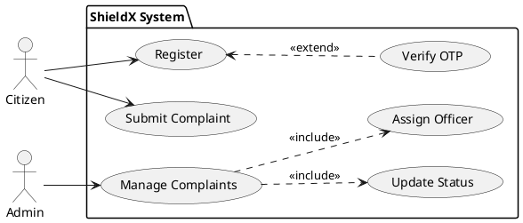
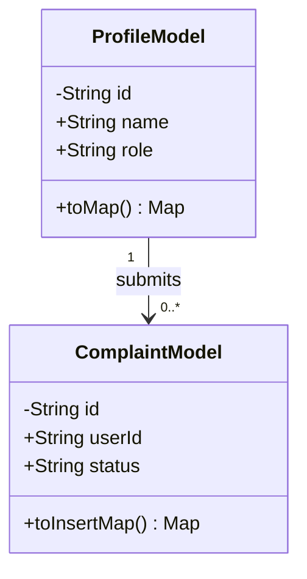
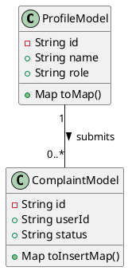
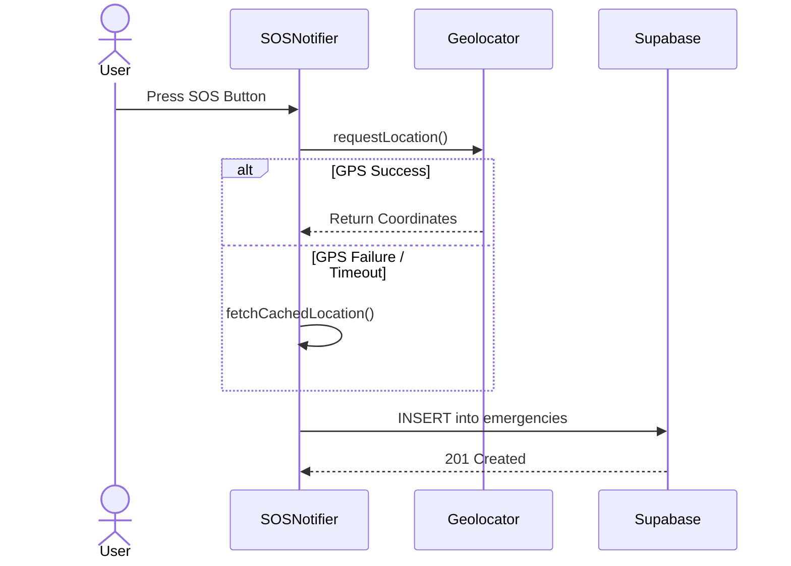
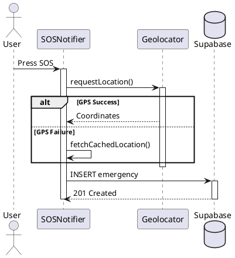
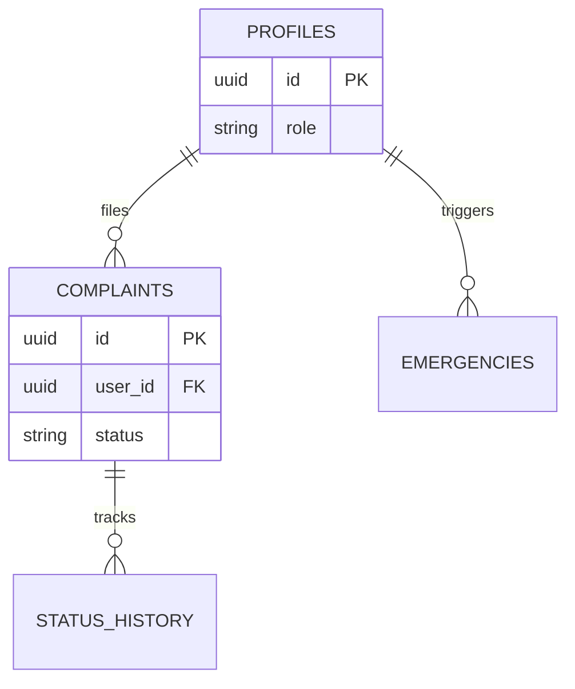
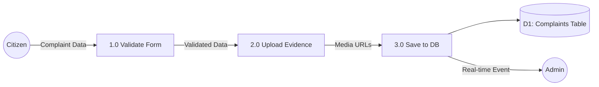
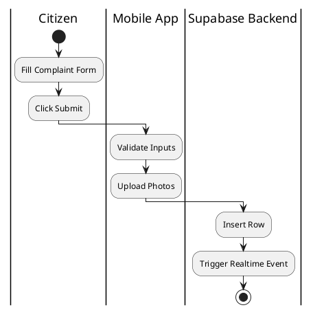

# Academic Defense Review - Part 1: UML & Diagram Validation

**Reviewer:** Senior Software Engineering Professor
**Project:** ShieldX – Crime Reporting Management System

This document provides a strict academic evaluation of the diagrams presented in the project report. Examiners look for strict adherence to OMG UML 2.5 standards and standard systems analysis methodologies.

---

## 1. Use Case Diagram Review

### Academic Critique
- **Issue:** Missing `<<extends>>` relationships.
- **Why it is wrong:** The diagram correctly models `<<includes>>` for Admin `Manage Complaints` (e.g., Update Status). However, the `Register` use case does not show alternative flows like `Verify OTP` or `Handle Duplicate NID`. 
- **UML Standard Violation:** UML 2.5 states that optional behavior or exception handling should be modeled using `<<extend>>`.
- **Correct Version:** Add a `Verify OTP` use case that `<<extend>>`s the `Register` use case.

### Professional Defense Version

**Improved Mermaid Code:**
```mermaid
usecaseDiagram
    actor Citizen
    actor Admin
    
    rectangle "ShieldX System" {
        usecase "Register" as UC1
        usecase "Verify OTP" as UC1_ext
        usecase "Login" as UC2
        usecase "Submit Complaint" as UC3
        
        usecase "Manage Complaints" as UA3
        usecase "Update Status" as INC1
        usecase "Assign Officer" as INC2
        
        Citizen --> UC1
        UC1 <.. UC1_ext : <<extend>>
        Citizen --> UC2
        Citizen --> UC3
        
        Admin --> UA3
        UA3 ..> INC1 : <<include>>
        UA3 ..> INC2 : <<include>>
    }
```

**Improved PlantUML Code:**


---

## 2. Class Diagram Review

### Academic Critique
- **Issue:** Missing strict Data Types, Visibility Modifiers, and Multiplicity on Associations.
- **Why it is wrong:** While `+id: String` is used, some fields lack private visibility (`-`) where appropriate (e.g., internal state). Furthermore, the arrows show relationships but do not strictly denote `1..*` multiplicity at both ends in standard OMG notation (e.g., `1` at Profile, `0..*` at Complaint).
- **UML Standard Violation:** UML requires explicit lower and upper bounds for multiplicity at association ends.
- **Correct Version:** Use `1` and `0..*` at the arrow heads. Make internal identifiers private.

**Improved Mermaid Code:**


**Improved PlantUML Code:**


---

## 3. Sequence Diagram Review

### Academic Critique
- **Issue:** Missing Execution Specification (Activation Boxes) and `opt`/`alt` blocks.
- **Why it is wrong:** The SOS sequence diagram shows messages flowing linearly. However, GPS fetching can fail. A Sequence Diagram must show the alternative flows (e.g., if GPS fails, use cached location). 
- **UML Standard Violation:** Lack of Combined Fragments (`alt` for if/else logic).
- **Correct Version:** Introduce an `alt` fragment for GPS Success vs. GPS Failure.

**Improved Mermaid Code:**


**Improved PlantUML Code:**


---

## 4. ER Diagram Review

### Academic Critique
- **Issue:** Notation Ambiguity.
- **Why it is wrong:** The diagram uses standard boxes and lines. In academic defense, examiners prefer strict Crow's Foot Notation (Information Engineering) or Chen's Notation for ERDs.
- **UML Standard Violation:** N/A (ERD is not strictly UML), but Database standards require explicit Cardinality symbols (e.g., `||--o{`).
- **Correct Version:** Use Crow's Foot notation to show that one Profile can have zero or many Complaints.

**Improved Mermaid Code:**


---

## 5. DFD (Data Flow Diagram) Review

### Academic Critique
- **Issue:** Missing Process Numbering and Data Store Notation.
- **Why it is wrong:** The Level-1 DFD must have strictly numbered processes (e.g., `1.0 Validate Complaint`, `2.0 Store Evidence`). The Data Stores must be open-ended rectangles, not standard nodes.
- **Standard Violation:** Gane & Sarson or Yourdon DFD rules violated by unnumbered processes.
- **Correct Version:** Number all processes logically.

**Improved Mermaid Code:**


---

## 6. Activity Diagram Review

### Academic Critique
- **Issue:** Missing Swimlanes (Partitions).
- **Why it is wrong:** The complaint submission involves the Citizen, the Mobile App, and the Backend. An Activity diagram without swimlanes makes it impossible to know *who* or *what* is responsible for an action.
- **UML Standard Violation:** UML 2.5 recommends Activity Partitions to show responsibilities.
- **Correct Version:** Split into three swimlanes: Citizen, App (Frontend), Supabase (Backend).

**Improved PlantUML Code:**

